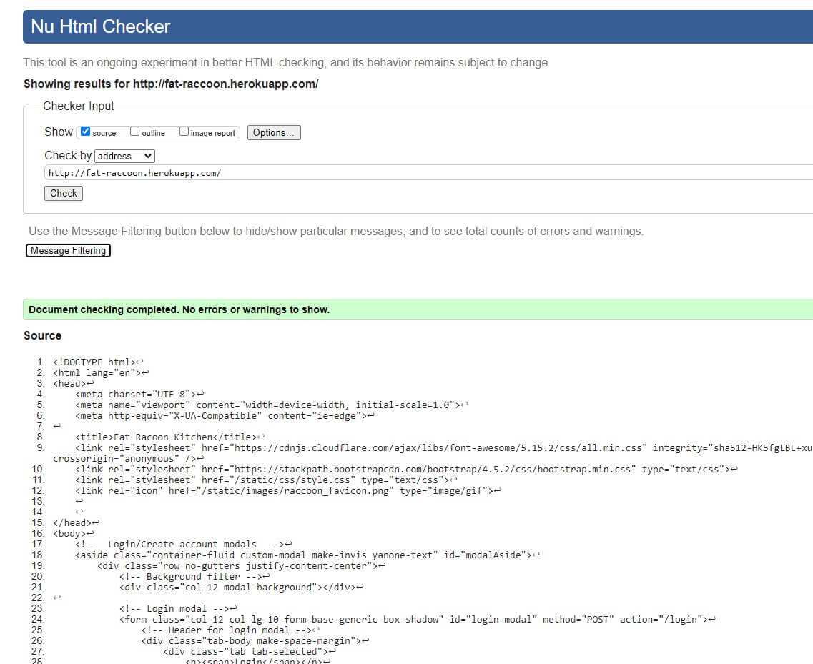

# Contents
[Fat Raccoon - Introduction](#fat-racoon---introduction)

[UX](#ux)
+ [Goals](#goals)
    + [User Goals](#user-goals)
    + [Developer Goals](#developer-goals)
+ [Client Stories](#client-stories)

[Design Choices](#design-choices)
+ [Header and Footer](#header-and-footer)
+ [Login and Create Account Modal](#login-and-create-account-modal)
+ [Index](#index)
+ [Lessons](#lessons)
+ [Profile](#profile)
+ [Recipe](#recipe)
+ [All Recipes](#all-recipes)
+ [Recipe List](#recipe-list)
+ [Add Edit Recipes](#add-edit-recipes)
+ [Edit User Info](#edit-user-info)
+ [Search Bar Returns](#search-bar-returns)
+ [Page Performance](#page-performance)
+ [Wireframe and Live Demo](#wireframe-and-live-demo)
    + [Wireframe](#wireframe)
    + [Live Application](#live-application)
+ [Scalability](#scalability)

[Technology Languages](#technology-languages)

[Testing](#testing)
+ [Developer Testing Specifications](#developer-testing-specifications)
    + [Developer Tested Systems](#developer-tested-systems)
    + [Developer Testing Methods](#developer-testing-methods)
+ [Developer Tests](#developer-tests)
    + [Testing Random Recipe](#testing-random-recipe)
    + [Testing Text Coss Out Function](#testing-text-coss-out-function)
    + [Testing All_Recipe And Recipe_List Pagination](#testing-all_recipe-and-recipe_list-pagination)
    + [Testing Recipe Upload](#testing-recipe-upload)
    + [Testing Search Chef Name](#testing-search-chef-name)
    + [Testing Browse Button for Lazy Favorites Recipes](#testing-browse-button-for-lazy-favorites-recipes)
    + [Testing Recipe Favorites Function](#testing-recipe-favorites-function)
    + [Testing Index Cards on Lesson Page](#testing-index-cards-on-lesson-page)
    + [Testing Profile Updates](#testing-profile-updates)
    + [Testing Delete Recipe - Full C.R.U.D. Test](#testing-delete-recipe---full-c.r.u.d.-test)
    + [Testing Delete Button for Recipes on Profile Page](#testing-delete-button-for-recipes-on-profile-page)
+ [Program Tests](#program-tests)
    + [BrowserStack](#browserstack)
    + [Lighthouse](#lighthouse)
    + [JigSaw](#jigsaw)
    + [W3C Validator](#w3c-validator)
    + [JSHint](#jshint)

[Bugs and Other Problems](#bugs-and-other-problems)
+ [Previous Bugs](#previous-bugs)
+ [CurrentBugs](#current-bugs)
+ [Other Problems](#other-problems)

[Deployment](#deployment)
+ [Setup structure on GitPod for Developers](#setup-structure-on-gitpod-for-developers)
    + [Flask](#flask)
    + [Pymongo](#pymongo)
+ [Deploy Clone in GitHub - GitPod](#deploy-clone-in-github---gitpod)
+ [Heroku Deployment](#heroku-deployment)
+ [Database Build](#database-build)
    + [Database Structure](#database-structure)
    + [Connecting to Database](#connecting-to-database)
    + [Create the Appropriate Collections](#create-the-appropriate-collections)

[Tools and Credits](#tools-and-credits)
+ [Tools](#tools)
+ [Credits](#credits)
    + [Code Citations](#code-citations)
    + [References and Ideas](#references-and-ideas)

+ [Acknowledgements](#acknowledgements)

# Fat Racoon - Introduction
<!-- Intro -->
The Fat Racoon is devoted to helping home cooks provide better meals.<!--to friends, family, and our users--> We provide a compendium of chef Fat_Raccoon's (combination of two chefs) personal recipes along with our user's recipes. 
All these recipes can be searched through with our in app search engine. We believe that even without the ideal ingredients on hand, a little extra knowledge or extra seasoning can help any meal become a savory experience. 
We even go out of our way to provide our new home cooks with some basic cooking lessons in our **lesson** section. The chefs of the Fat Raccoon know the importance of making the best out of what we have on hand and want to 
share that liberating experience with others.
<!-- About us -->
The head chefs of the Fat Racoon started as sleep deprived, nocturnal home cooks that would use the, leftover "garbage" from the fridge to make a meal. With practice and study, these meals improved over time, but it started with 
learning fundamental cooking practices, including how to pair flavors and learning to generalize measurements. The Fat Raccoon's **Lesson** section offers this general cooking knowledge and more to help our new cooks get started. 
Chef Fat_Raccoon offers a personal insight to a recipe in the recipe's description and ingredients sections. It is important to the Fat Raccoon that new cooks see not every recipe has to be complicated or convoluted. 
We hope this helps others spend their kitchen time wisely and they make the best meals they can. 
<!-- Community -->
The Fat Raccoon hopes to facilitate a growing compendium of its user's. The Fat Raccoon currently offers users the ability to search other home cooks by their username but we wish to expand upon this in the future. 
With this basic structure in place, we at the Fat Raccoon hope to establish a community of home cooks and catalogue their recipes with an intuitive search engine which 
will be a boon to home cooks everywhere. 
<!-- The Fat Raccoon also hopes its users see 
The Fat Racoon wants to help establish a community of home cooks and catalogue their recipes with an intuitive search engine which 
will be a boon to home cooks everywhere. -->
<!-- It helps newer cooks see that not every recipe has to be complicated or convoluted.-->
<!-- The Fat Raccon offers these conventional cooking practice and recipe guidance to help them along the way.  -->
<!-- Chef Fat_Raccoon's recipes will help newer cooks see that not every recipe has to be complicated or convoluted. -->
<!-- This can be found in our **lesson** section and the extra information provided within chef Fat_Raccoon's recipe descriptions and ingredients.  -->

<!-- Casual users -->
Our casual users just searching for a recipe, we offer several different search methods to help them find what they are looking for. These users can search our database by chef, featured ingredient, or recipe name. 
The front page also offers other methods for users to browse the Fat Raccoon's recipes, such as: **Lazy Favorites**, **Grandparent Classics**, all of **Chef Fat_Raccoon's Recipes**, and **Featured Ingredient**.
<!-- Users that create recipes -->
For our home cooks that are submitting recipes, we offer a place to put in a recipe name, the prep/cook/total time, a picture, a brief recipe description, ingredients, and steps. 
This allows anyone to easily keep track of recipes and share them with others.Additionally, if the Fat Raccoon finds these recipes appropriate, they can add the tags **Lazy Favorite**, **Grandparent Classic**, or both.
<!-- Meaning behind cooking -->
Cooking has more meaning than just preparing food. For many it is a connection to your history or life experiences. We encourage our users to give us a little personal touch to the recipes they submit.
It's important to the Fat Raccoon's mission to preserve personal and family history through sharing recipes and creating a strong community of home cooks. 
<!-- meta information in the recipes they submit. 
Let us help preserve a little of ourselves in a recipe. Its important to us and to those that submitted it. From a family recipe to this is all I could afford 
in college, let us know! -->

**Disclaimer:** This is a nonprofit student site and has some 3rd party recipes in it. These recipes are used as database information and these recipes are documented as such in their recipe description section. 

# UX
## Goals
### User Goals
+ I want to find a recipe for dinner. <!-- Testing Random Recipe -->
+ I want to use my smart phone or tablet as a recipe book. <!-- Testing Text Coss Out Function -->
+ I want to find a new chicken dish to cook. <!-- Testing All_Recipe And Recipe_List Pagination-->
+ I want a place to leave a recipe so I can easily find it later. <!-- Testing Recipe Upload --> <!-- Tests Create and Read from C.R.U.D. -->
+ I want help deciding what to cook for dinner and I like a specific chef's recipes. <!-- Testing Search Chef Name -->
+ I want a easy-to-make recipe. <!-- Testing Browse Button for Lazy Favorites Recipes -->
+ I can't remember the name of a recipe that i liked on the Fat Raccoon and I want to find it again. <!-- Testing Recipe Favorites Function --><!-- Tests edit from C.R.U.D. -->
+ I want an easy-to-read recipe layout while I'm cooking. <!-- Testing Text Coss Out Function - testing function already satisfied -->
+ I lack confidence in my cooking ability and need help. <!-- Testing Lessons Index Cards -->
+ I've decided I don't like my user bio or avatar anymore and want to change them. <!-- Tests update of user information/avatar --> <!-- Tests update from C.R.U.D. -->
+ I've uploaded a recipe I don't like anymore and I want to remove it. <!-- Tests for deletion of recipe --><!-- Tests delete from C.R.U.D. -->
+ I deleted my recipe but I forgot to unfavorite it. Now I want to remove it from my profile page. <!-- Tests delete button for favorites/recents in profile --> <!-- Tests edit from C.R.U.D. -->

### Developer Goals
+ As a school project, this site was developed using as little 3rd party code as possible (ex. carousel logic was written by developer and Bootstrap's version was not used on purpose). This 
was a deliberate choice to help the developer gain a better understanding of how languages such as JS and Python function and not done out of ignorance.

+ I want to showcase my Python abilities.
    + Importing Python libraries (Ex. datetime, random, etc...).
    + Using Flask's dependencies, such as: flash, render_template, redirect, request, session, and url_for.
        + Using these dependencies in advanced ways. One such example is using a single Jinja template for multiple functions. This can be seen on:
            + (Ex. `add_edit_recipe.html`)
            + (Ex. `base.html`)
            + (Ex. `recipes.html`)
    + Using Pymongo (Flask - MongoDB).
    + Creating Python validation logic, which:
        + Checks filetype submitted.
        + Checks max and min character length.
        + Checks for allowed characters.
    + Creating a callable function library instead of repeating code.
    + Minimizing function length.
    + Using if expressions, that:
        + Replace blank sections (missing database data) with filler templates.
        + Add a specific banner on random recipe.
        + etc....
    + Using for expressions, that:
        + Generate list data for recipe lists, recipe ingredient lists, recipe step lists, etc....
    + Using a random number generator to randomly select recipes.

+ I want to showcase my JS abilities.
    + Creating carousel JS logic.
    + Creating pagination JS logic.
    + Creating validation JS logic that:
        + Checks character length.
        + Checks for allowable characters.
        + Compares two passwords to be sure they match.
        + Checks for appropriate email suffix.
        + Replace spaces with `_` using a regex.

+ I want to showcase my MongoDB's (NoSQL database) database abilities.
    + Restricting user searches to specific content.
        + One example is, only allowing users to search for chef name, featured ingredient, and recipe name.
    + Removing non pertinent data sent to clients from server (if possible). 
        + Restricted user searches remove recipe ingredient(s), recipe step(s), and recipe description from its returns.
    + Searches use operators if applicable.
        + The `$or` operator is used to allow a list of Python dictionary `ObjectId` to be compiled and sent to MongoDB as a single inquiry.
    + Creating a new recipe or account document will build upon a prestored blank template instead of creating an entirely new document each time. (This allows for cleaner coded Python to upload content.)
    + Allow users to upload avatars for their profile and recipes.

+ I want to showcase my artistic ability.
    + Using CSS art.
        + Created sticky notes with lifting effect.
        + Created drinks.
            + Stylized as tea with ice in it.
                + The drink ripples when a user's mouse cursor passes over it.
                + The drink's "ice" has a diping effect when a user's mouse cursor passes over it.
        + Created napkins that the drinks sit on.
        + Created Polaroid pictures.
        + Created table runners (header and footer).
    + Using SVG art.
        + Created favicon and Fat Raccoon logo (raccoon face).
        + Created blank head chef avatar place holder (black and blue silhouette).
        + Created arrows for carousel.

## Client Stories
+ I want to find a recipe for dinner.
    + I opened the Fat Raccoon's main page. I don't really know what I want so I scrolled down to the bottom of the page. I liked the random recipe I saw on the bottom of the page and decided to use that recipe. 
+ I want to use my smart phone or tablet as a recipe book.
    + I opened the Fat Raccoon's main page and found a recipe I like. I went to the recipe's page to see what I need to make the recipe. I've found that if I click the item's check box, it crosses out the box and the text of the item. 
    I turned my device off and on, and I found it didn't automatically reset the screen I was on so all the boses are still checked. I think I will keep using my device to easily keep track of what ingredient(s) I still need or what step 
    of the recipe I am on.
+ I want to find a new chicken dish to cook.
    + I opened the Fat Raccoon's main page. I didn't immediately find a chicken recipe that I liked. I found a button, **Browse by Featured Ingredient!**, and I clicked it. I found the featured ingredient section for chicken 
    and all the chicken recipes I could want!
+ I want a place to leave a recipe so I can easily find it later.
    + I opened the Fat Raccoon's main page. I want to have a digital place to keep a recipe, so I created a Fat Raccoon account. The app took me to my newly created profile page. I clicked the **Share Recipe** button
    and filled out all the recipe's information and even an image. I've discovered that I can edit my recipe from its recipe page in the Fat Raccoon app. I've also found I can favorite my own recipe from its page. If I go to my 
    profile, it is in the **10 Recently Uploaded Recipes** section of my profile so I can easily find my recipe whenever I want it.
+ I want help deciding what to cook for dinner and I like a specific chef's recipes.
    + My friends, Mrs. Fat Raccoon and her husband, Mr. Fat Raccoon have similar taste in food as me and I want to easily find all of their recipes. I opened the Fat Raccoon's main page and scrolled to the bottom of the 
    page where I found a button, **Browse Chef Fat_Raccoon's recipes!**, and I clicked the button. I am now able to see all of the chef Fat_Raccoon's recipes.
    + My friend has an account on the Fat Raccoon app and I know her/his username name. I open the Fat Raccoon's main page and put my friends username name into the search bar and now I am able to see all of my friend's
    uploaded recipes.
    + I opened the Fat Raccoon's main page and clicked on **Recipes** in the navigation bar. I found a recipe on the recipe page that I liked, however it wasn't made by the chef Fat_Raccoon! I did find that 
    if I clicked on the chef's name under the picture of their recipe it takes me to all the recipes submitted by this chef.
+ I want an easy-to-make recipe.
    + It's been a long day, I'm tired, and want an easy recipe to make for dinner. I opened the Fat Raccoon's main page and scrolled to the bottom of the page and found a button, **Browse our Lazy Favorites!**. I clicked this 
    button and I found numerous recipes that don't require much effort.
+ I can't remember the name of a recipe that i liked on the Fat Raccoon and I want to find it again.
    + I opened the Fat Raccoon's main page and realized that I don't remember the name of the recipe I was looking at last night. I remembered I was logged in, so I logged into my
    Fat Raccoon account. I was taken to my profile page where I easily found the recipe I was looking at last night in my **10 Recently Viewed Recipes** section.
    + I opened the Fat Raccoon's main page and realized that I don't remember the name of the recipe I wanted to try. I logged into my Fat Raccoon account and I'm taken 
    to my profile page. I don't see the recipe in my **10 Recently Viewed Recipes**, however I did favorite the recipe and I easily find the recipe in my **10 Recently Favorited Recipes**
    section
    + I opened the Fat Raccoon's main page and realized that I don't remember the name of the recipe I wanted to try. I logged into my Fat Raccoon account and I'm taken 
    to my profile page. I don't see the recipe in my **10 Recently Viewed Recipes**. I also did not find the recipe in my **10 Recently Favorited Recipes** section.
    I clicked on my **10 Recently Favorited Recipes** header and I'm taken to a list of all my favorite recipes. I found the recipe there.
+ I lack confidence in my cooking ability and need help.
    + I opened the Fat Raccoon's main page and I realized I'm completely outside of my comfort zone. I wanted to try a recipe but every time I cook, something is terrible 
    about the experience. I saw the **Lesson** section in the navigation bar and decided to give it a shot. I found numerous helpful tips that gave me the confidence to 
    try a recipe that looked good.
+ I've decided I don't like my user bio or avatar anymore and want to change them.
    + I logged into my Fat Raccoon account and I'm taken to the profile page. I clicked on the **Update Profile** button. I chose a new image from my pc and updated my bio to be a better representation of myself.
     I also had to put in my current password before the form allowed me to submit it. I submitted the form and was taken back to my profile page where I saw the updated avatar and bio.
+ I've uploaded a recipe I don't like anymore and I want to remove it.
    + I logged into my Fat Raccoon account and I'm taken to the profile page. I went to my recipe's page that I wanted to delete. I clicked the **Delete Recipe** button. I was prompted to type in the recipe's name.
    I typed in the recipe's name and the delete button turned green. I deleted the recipe. I'm taken back to my profile page where the app let me know I've deleted the recipe.
+ I deleted my recipe but I forgot to unfavorite it. Now I want to remove it from my profile page.
    + I logged into my Fat Raccoon account and I'm taken to the profile page where I am reminded of my error on my **10 Recently Favorited Recipes** and **10 Recently Viewed Recipes** sections. When I clicked on the recipe 
    the app notified me that the recipe has been deleted. I saw that a button next to the recipes on **10 Recently Favorited Recipes** and **10 Recently Viewed Recipes** looks like a delete icon. I click this button and the 
    recipe is removed from my favorites.

# Design Choices
## Header and Footer
+ Southern theme:
    + Cutting board logo with stylized engraved text.
    + Southern table runner for background.
    + Social media links are stylized as drinks.
+ Plain Bootstrap navigation bar with integrated search engine for a good UX.

## Login and Create Account Modal
+ Both login and create account modals are accessible from any non-logged-in page.
+ Form validation (Python and JS) prevents users from submitting improper form details and helps improve their submittion experience.
    + All input's use JS and Python as a duel-layered check before allowing upload.
    + These checks look at characters, character length, and blank space input.
    + A regex changes spaces to `_` for password, username, and email inputs.
    + Email validation:
        + Email validation is limited because of suffixes allowed.
            + Currently checks for the email suffixes `.com`, `.edu`, `.net`, `.org`.
            + Currently checks for an `@`.

## Index
+ Index card carousel:
    + Recipes added to index cards for a home-made look.
    + Carousel offers three randomly selected recipes per featured ingredient from the head chef of the site.
    + Helps give users recipe options based on the featured ingredient they want to cook with.
+ Grandparent Classic Polaroids:
    + Recipe images are used  with a Polaroid picture design. This design is used to make users feel the nostalgia of a recipe their grandparents might have prepared.
    + The recipe's name is added to the bottom of the picture to let users know what recipe they are viewing.
+ Random recipe section:
    + Quick browsing links are provided to give users ample ideas for cooking.
    + A random recipe with basic information and an image is provided to give users an idea of what to cook.
        + Some of the random recipes have a banner to show if the recipe is a **Lazy Favorite**, **Grandparent Classic**, or both.
        + This section also houses the head chef's bio and image to help give the site a welcoming feeling.

## Lessons
+ Index cards:
    + A simple comment is added to the cards to let users know  that the cards are clickable.
        + Each index card be flipped over with most of them containing information on both sides.
    + The information provided will give new cooks some hints and tricks at getting started in the kitchen and making the best of what they have on hand.

## Profile
+ Profile header buttons:
    + Two buttons below the navigation bar allow users to either: share a new recipe  or update their profile.
+ Users can clearly see their own bio and avatar image. This is a way to give users a feeling of personalization.
+ Users have access to their entire uploaded or favorite recipe history with a single click of said items header.
    + Users will always be able to see their 10 recently uploaded/favorited/viewed in their respective containers.
    + This allows users to keep track of recipes they want to return to.

## Recipe
+ Logged in recipe creator:
    + Can modify or delete that recipe. By using its respective header button.
+ Logged in user:
    + Can favorite a recipe so they can easily return to it later.
+ Clearly displays avatar image so users can see what dish looks like (or displays a defaut blank).
+ All general recipe information is displayed and easily viewed.
+ Recipe's ingredients and steps:
    + Each labeled in their own lists.
    + Each item has its own check box.
    + Users can click on any part of the item and it will check the box and cross out the item clicked.

## All Recipes
+ Lists entire database of recipes by their featured ingredient.
+ When a featured ingredient contains more than 5 recipes the list updates to have pagination at the bottom of the featured ingredient container.
+ Each featured ingredient container is given a header of the featured ingredient name so users can easily understand what is in each container.
+ Each listed recipe displays its name and combined cook and prep time to help users decide what they want to make (at smaller resolutions its just a recipe name).
+ Users can click on featured ingredient header to go to a page containing only that featured ingredients.

## Recipe List
+ When a featured ingredient contains more than 5 recipes the list updates to have pagination at the bottom of the featured ingredient container.
+ Each listed recipe displays its name and combined cook and prep time to help users decide what they want to make (at smaller resolutions its just a recipe name).

## Add Edit Recipes
+ Uses a plain form that is intentionally more blandless than the rest of the page. This is to give users a more serious feeling when creating and editing recipes.
+ Users can update every part of a recipe except the boolean tags of **Lazy Favorite** and **Grandparent Classic** (which is reserved for the head chef of the site to make this decision).
+ There is basic (Python + JS) validation:
    + The image uses JS to check its file size and Python to check its file type.
    + All other input and textareas use JS and Python as a duel-layered check before allowing upload.
    + These checks look at characters, character length, and blank space input (ingredients/steps).
+ Total cook time updates automatically as prep and cook times are adjusted.
+ Recipe ingerdients and recipe steps:
    + Each uses a JS add/remove set of buttons for users to create and remove boxes as they need.
    + Each box is numbered to help users keep track of the number they are at.
    + The header of recipe ingredient or recipe steps will keep an active count of visible boxes so users know how many boxes they have created without scrolling down.
    + If a user submits a blank entry box (including spaces) the Python validation will remove said box(s).

## Edit User Info
+ Uses a plain form that is intentionally more blandless than the rest of the page. This is to give users a more serious feeling when editing their profile.
+ Users are able to update their password, username, email, avatar, and bio.
+ There is basic (Python + JS) validation:
    + The image uses JS to check its file size and Python to check its file type.
    + All other input and textareas use JS and Python as a duel-layered check before allowing upload.
    + These checks look at characters, character length, and blank space input.
    + A regex changes spaces to `_` for password, username, and email inputs.
    + Email validation:
        + Email validation is limited because of suffixes allowed.
            + Currently checks for the email suffixes `.com`, `.edu`, `.net`, `.org`.
            + Currently checks for an `@`.
    + Additional validation for new password creation:
        + Uses Python and JS to check that both typed passwords are identical.
+ Users wishing to create a new password, must click on the **Create New Password** button. This keeps users from accidently invalidating the form by starting new password validation. This 
is addressed in **Scalability** and **Other Problems**.

## Search Bar Returns
+ This page is used to return three different search type results:
    + Returns user searches from search bar.
        + This search is a restricted to recipe name, feature, and chef.
        + This same return functions with the browse button, **Browse Chef Fat_Racoon's Recipes**.
        + This search does not include recipe ingredients, recipe steps, or recipe description of the requested documents. This is to lesson the burden on the server and the clients internet usage.
    + Returns the profile page's recently **10 Recently Favorited Recipes**, and **10 Recently Viewed Recipes** searches.
        + This search uses the `$or` operator to find all the recipes detailed the aforementioned sections in one clean search instead of multiple searches.
    + Returns the profile page's **10 Recently Uploaded Recipes** searches.
        + This search does not include recipe ingredients, recipe steps, or recipe description of the requested documents. This is to lesson the burden on the server and the clients internet usage.
    + Returns the index browse button searches for **Browse our Grandparent Classics** and **Browse our Lazy Favorites**.
        + This search works only for boolean value results.

## Page Performance
+ The Fat Raccoon app has a responsive design across all devices.

+ All developer uploaded images are tinyified to reduce image download times.

## Wireframe and Live Demo
### Wireframe
+ Each wireframe contains curly brackets that give a description of its contents and what the filler (missing database data) content should be.

+ [Balsamiq](https://balsamiq.com/) was used for the planning process.
+ Wireframes were made for all predetermined size variations of the webpage.
+ Wireframes were made for the models to streamline their design. This also allowed for them to be shown without over complicating the primary page design.
+ [Click here to view all wireframes associated to this project.](static/readme/wireframe "Location of wireframes")

### Live Application
+ A fully functioning application can be found on [Heroku](https://fat-raccoon.herokuapp.com/ "Deplayment location").

+ [GitHub's](https://github.com/) IDE [GitPod](https://www.gitpod.io/) was used for the construction process.
+ GitHub houses the [master branch](https://github.com/Richardaeld/Fat_Racoon_Kitchen).

## Scalability
+ Validation:
    + Unify Python and JS validation for images. This would allow JS and Python to check the same material. This would ensure a better UX.
    + Improve email validation to accept a wider range of email suffixes (ex. regional suffix, .uk, .fr, .de). This would allow for a larger audiance of users.
    + Improve JS validation to use less pre-packaged validation types and more compartmentalized validation.
        + Example: 
            + Use classes for JS to set validation for character count, characters allowed, and if spaces are allowed. 
            + Each of these aforementioned items could be set with a different type class that could be applied independent of one another.
            + Each of these different types of classes could have hypen values to differentiate their purpose.
                + (ex. charMax-20)
                + (ex. charMax-100)
                + (ex. charMax-400)
            + This type of dynamic validation system would improve the overall readability and function of the JS validation code.
    + A stronger form of validation could be used. The validation in place is simple and limited.
        + One good example, a user can invalidate recipe steps or recipe ingredients by tabing to them. This forces users to add content or remove the unused box before they can submit the form.
    + A different approach to validation could be the adaptation of a prewritten validator (ex. WTForms) into the Fat Raccoon application.
        + This could allow for the JS restrictions to be lifted, leaving only the bubble comments to help users properly fill out the forms.
        + This would also allow for less redundent and convoluted JS code.
+ The addition of image processing capabilities to python (Ex. Python Pillow).
    + This would allow the Fat Raccoon application to automatically configure and alter images rather than relying on user upload restricts.
+ Adding user selectable filters to search bar. This would ensure a better more efficient user search.
+ Create a user comment form for the recipes. This would give a better sense of community for users.
+ Create a user rating system for recipes. This would give a better sense of community for users.
+ Improve search engine to accept a **space** as an `_` to help users more easily find chefs with a single or multiple "space(s)" in their name.

# Technology Languages
+ HTML - Skeleton frame of the application.
+ CSS - Beautifies the skeleton (HTML).
+ JavaScript - Allows for user interaction and some dynamic function on the application.
+ Python - Allows back end programs to run. These programs (frameworks, libraries, and databases) are:
    + Flask - Allows use of templating, security, user searching, and other critical functions.
    + Pymongo - Allows Flask (Python) to communicate with MongoDB.
    + PythonDNS - Allows for DNS data transfer.
    + Werkzeug - Encrypts data as it is sent between the user and server.
    + Datetime - Allows Python to take a date/time stamp.
    + Random - Allows a for a random number generator.
+ MongoDB - NoSQL database that application communicates with and stores information on.

# Testing
## Developer Testing Specifications
### Developer Tested Systems
+ Windows 10 (Chrome 87**, Edge 87**, Firefox 84**)
    + Chrome
        + Developed in Chrome
        + Initially tested in every bootstrap breakpoint during development.
        + Tested in landscape, which is desktop responsiveness level.
        + Tested in portrait, which is tablet responsiveness level.
    + Edge
        + Tested in landscape, which is desktop responsiveness level.
        + Tested in portrait, which is tablet responsiveness level.
    + Firefox
        + Tested in landscape, which is desktop responsiveness level.
        + Tested in portrait, which is tablet responsiveness level.
+ G8 ThinQ (Chrome 87**)
    + Chrome
        + Tested in landscape, which is tablet responsiveness level.
        + Tested in portrait, which is Mobile responsiveness level.
+ iPad, 5th gen 13.3(Safari 13**)
    + Safari
        + Tested in landscape, which is tablet responsiveness level.
        + Tested in portrait, which is mobile responsiveness level.

### Developer Testing Methods
+ Every test of **Developer Tests** was preformed on the above listed systems and the specified screen orientation.
+ The tester will perform each test of **Developer Tests** three times: 
    + Once in landscape.
    + Once in portrait.
    + Once with random moments of spam clicking and switching between landscape/portrait.
        + The final of the three tests is critical to be sure tablet and mobile users have a enjoyable experience.

## Developer Tests
### Testing Random Recipe

---

#### Tests User Story
+ I want to find a recipe for dinner. <!-- Testing Random Recipe -->

#### Expectation(s):
1. The recipe displayed in random recipe is actually random.
1. The random recipe's banner functions correctly.
1. The page content fills appropriately and doesn't spill out beyond obvious borders.
1. The page content doesn't overlap and is easily read.

#### Assumption(s):
1. The tester will keep performing this test until they see a classic banner, a favorite banner, and a favorite/classic banner.
1. The tester has list of recipes that contain the favorite, classic, and favorite/classic boolean tag.

#### Testing Step(s):
1. Load the **Index Page** of the Fat Raccoon.
1. Scroll to the bottom of the page.
1. Click the **random recipe** to make sure it links to the proper recipe.
1. Repeat steps 1 - 3 approximately three to five times to check for randomization of recipe.

#### Document Result(s):
1. if any links are broken, record:
    + The test name and recipe name.
1. If any recipe displays an incorrect banner, record:
    + The test name, recipe name, banner anticipated, and banner displayed.
1. if any content has bad UX, record:
    + The test name, recipe name, screen resolution, browser/device, and page (Jinja template)
1. if there is an incorrect box shadow, record:
    + The test name, recipe name, screen resolution, browser/device, and page (Jinja template)

### Testing Text Coss Out Function

---

#### Tests User Story
+ I want to use my smart phone or tablet as a recipe book. <!-- Testing Text Coss Out Function -->

#### Expectation(s):
1. The content of the **Recipe Steps** and **Recipe Ingredients** sections cross out correctly.
1. The page content fills appropriately and doesn't spill out beyond obvious borders.
1. The page content doesn't overlap and is easily read.

#### Assumption(s):
1. The tester knows the size for each clickable area that causes the crossout effect and will be choosing a different place to click every time.
1. The tester knows multiple ways to get to a recipe's page.
1. The tester is not repeatingly using the same path to a recipe page.

#### Testing Step(s):
1. Load the **Index Page** of the Fat Raccoon.
1. Navigate to any recipe page.
1. Scroll to the **Recipe Ingredients** section and click the check box or text to see if it crosses out correctly.
1. Scroll to the **Recipe Steps** section and click the check box or text to see if it crosses out correctly.
1. Repeat steps 2 - 4 selecting a different path to recipe page each time (or until all known paths are used).
1. Repeat step 5 approximately three times to check for appropriate overall good UX.

#### Document Result(s):
1. The test name, recipe name, if **Recipe Steps** or **Recipe Ingredients** would not cross out properly.
1. The test name, recipe name and choice of path to said recipe if any links are broken.
1. The test name, recipe name, screen resolution, browser/device, and page (Jinja template) if any content has bad UX.
1. The test name, recipe name, screen resolution, browser/device, and page (Jinja template) if there is an incorrect box shadow.

### Testing All_Recipe And Recipe_List Pagination

---

#### Tests User Story
+ I want to find a new chicken dish to cook. <!-- Testing All_Recipe And Recipe_List Pagination-->

#### Expectation(s):
1. Pagination appears when its supposed to.
1. Pagination doesn't obscure any content.
1. The page content fills appropriately and doesn't spill out beyond obvious borders.
1. The page content doesn't overlap and is easily read.

#### Assumption(s):
1. Thte tester will create dummy recipes for this test (if necessary), and keep a record of said dummy data.

#### Testing Step(s):
1. Load the **Index Page** of the Fat Raccoon.
1. Click on **Recipes** on the navigation bar. (This is the Jinja template, **All_Recipes**)
1. Find any **Featured Ingredient** that contains a pagination `ul` (or make some recipes to trigger pagination).
1. Click through all the numbers of the pagination `ul` (or five random pagination numbers).
1. Repeat step 4, for one other **Featured Ingredient** with a pagination `ul`.
1. Find any **Featured Ingredient** with a pagination `ul` and click on the **Featured Ingredient** header. (This will open the Jinja template, **Recipe_List**.)
1. Click through all the numbers of the pagination `ul` (or five random pagination numbers).
1. Repeat steps 2, 6, and 7 approximately one time.

#### Document Result(s):
1. Any dummy data created to fullfill the test's requirments.
1. The test name, recipe name, **Featured Ingredient**, screen resolution, browser/device, page (**All_Recipes** or **Recipe_List**), and pagination number if any pagination has bad UX.
1. The test name, recipe name, screen resolution, browser/device, and page (Jinja template) if any content has bad UX.
1. The test name, recipe name, screen resolution, browser/device, and page (Jinja template) if there is an incorrect box shadow.

### Testing Recipe Upload

---

#### Tests User Story
+ I want a place to leave a recipe so I can easily find it later. <!-- Testing Recipe Upload --> <!-- Tests Create and Read from C.R.U.D. -->

#### Expectation(s):
1. The recipe uploads without error.
1. The recipe displays correctly on its page.
1. The page content fills appropriately and doesn't spill out beyond obvious borders.
1. The page content doesn't overlap and is easily read.

#### Assumption(s):
1. The tester will intentionally try to submit incorrect data to check for incorrect validation.
1. The tester will create an account for this test, and will keep a record of said account.
1. The tester has a PNG or JPG file under 500kb, a PNG or JPG over 500KB, a non PNG or JPG image file under 500KB, and a none PNG or JPG image file over 500KB.
1. Tester knows the difference between the JS and Python validation.
1. The tester knows what this form considers invalid and will check every part of the validation. (Example, max character, min character, spaces, characters, etc....)

#### Testing Step(s):
1. Load the **Index Page** of the Fat Raccoon.
1. Click on **Login** on the navigation bar.
1. Click on **Create Account** tab.
1. Fill out all appropriate information and submit said information.
1. Once the **Profile** page is loaded, click on the **Share Recipe** button.
1. Fill out all appropriate information, including an avatar, and submit the new recipe.
1. Once the new recipe page is loaded, Check over newly created recipe for all appropriate information.
1. Navigate back to **Profile** and click on the **Share Recipe** button again.
1. Fill out the form with all appropriate information, including an avatar.
1. Choose one element of the form to incorrectly fill out and attempt to submit.
1. Repeat step 10 until all of the form's user inputs (recipe name, prep time, cook time, recipe description, recipe ingredients, and recipe steps) have had their validation tested. 
1. Attempt to submit same recipe with a PNG or JPG file over 500KB, a non PNG or JPG file under 500KB, and a none PNG or JPG file over 500KB.
1. Return to original submitted recipe.
1. Click **Edit Recipe**.
1. Repeat steps 9 - 12.

#### Document Result(s):
1. The test name, any input/textarea that incorrectly accepted/refused information, what form of validation failed (include wheather it was JS, Python, or both), and if it was a new recipe or edited recipe if any form of validation fails.
1. The test name, recipe name, screen resolution, browser/device, and page (Jinja template) if any content has bad UX.
1. The test name, recipe name, screen resolution, browser/device, and page (Jinja template) if there is an incorrect box shadow.

### Testing Search Chef Name

---

#### Tests User Story
+ I want help deciding what to cook for dinner and I like a specific chef's recipes. <!-- Testing Search Chef Name -->

#### Expectation(s):
1. The chef search returns the correct information.
1. The page content fills appropriately and doesn't spill out beyond obvious borders.
1. The page content doesn't overlap and is easily read.

#### Assumption(s):
1. Tester knows all recipes that belong to **Fat_Raccoon**.

#### Testing Step(s):
1. Load the **Index Page** of the Fat Raccoon.
1. Click on the navigation bar's search bar.
1. Input **Fat_Raccoon** into the search bar and submit.
1. Check over the returns to make sure all appropriate returns are shown.
1. Return to the **Index Page** of the Fat Raccoon.
1. Scroll to the bottom of the page, where the **Random Recipe** is located.
1. Click on the chef's name, **Fat_Raccoon** under the recipe's name.
1. Check over the returns to make sure all appropriate returns are shown.
1. Return to the **Index Page** of the Fat Raccoon.
1. Scroll to the bottom of the page, where the **Random Recipe** is located.
1. Find the sticky note with **Head Chef** on it and click on **Fat_Raccoon** at the bottom of that sticky note.
1. Check over the returns to make sure all appropriate returns are shown.
1. Select any recipe from the chef **Fat_Raccoon** and go to that recipe's page.
1. Under the avatar image, click on the name **Fat_Raccoon**.
1. Check over the returns to make sure all appropriate returns are shown.
1. Return to the **Index Page** of the Fat Raccoon.
1. Scroll to the bottom of the page, where the **Random Recipe** is located.
1. Click on the **Browse Fat_Raccoon Recipes** button.
1. Check over the returns to make sure all appropriate returns are shown.

#### Document Result(s):
1. Documentation of any link that does not appropriately link to all of **Fat_Raccoon**'s recipes, (including where the link was located).

1. The page (Jinja template), and location on the page where the link is if there is any broken links or they display incorrect information.

1. The test name, recipe name, screen resolution, browser/device, and page (Jinja template) if any content has bad UX.
1. The test name, recipe name, screen resolution, browser/device, and page (Jinja template) if there is an incorrect box shadow.

### Testing Browse Button for Lazy Favorites Recipes

---

#### Tests User Story
+ I want a easy-to-make recipe. <!-- Testing Browse Button for Lazy Favorites Recipes -->

#### Expectation(s):
1. The page content fills appropriately and doesn't spill out beyond obvious borders.
1. The page content doesn't overlap and is easily read.

#### Assumption(s):
1. Tester knows all recipes tagged as **Lazy Favorite**
1. Tester will refresh screen while in landscape and transition it to portrait at start of each page.
1. Tester will refresh screen while in portrait and transition it to landscape at start of each page.

#### Testing Step(s):
1. Load the **Index Page** of the Fat Raccoon.
1. Scroll down to **Random Recipe** section.
1. Click on the button **Browse our Lazy Favorites!**.
1. Check over returned recipes to make sure all appropriate recipes are shown.

#### Document Result(s):
1. Documentation of any recipes that do not appropriately show up when **Browse our Lazy Favorites** button is clicked.
1. The test name, recipe name, screen resolution, browser/device, and page (Jinja template) if any content has bad UX.
1. The test name, recipe name, screen resolution, browser/device, and page (Jinja template) if there is an incorrect box shadow.

### Testing Recipe Favorites Function

---

#### Tests User Story
+ I can't remember the name of a recipe that i liked on the Fat Raccoon and I want to find it again. <!-- Testing Recipe Favorites Function --><!-- Tests edit from C.R.U.D. -->

#### Expectation(s):
1. Favorite icon responds appropriately to recipes status of favorite vs unfavorite.
1. The page content fills appropriately and doesn't spill out beyond obvious borders.
1. The page content doesn't overlap and is easily read.

#### Assumption(s):
1. Tester will create an account for this test and keep a record of said account to be appropriately handled after testing.
1. Tester knows the difference between a favorited recipe and an unfavorited recipe icon.
1. Tester will unfavorite at least a single recipe and check for appropriate response.
1. Tester will refresh screen while in landscape and transition it to portrait at start of each page.
1. Tester will refresh screen while in portrait and transition it to landscape at start of each page.

#### Testing Step(s):
1. Load the **Index Page** of the Fat Raccoon.
1. Click on **Login** in navigation bar.
1. Click on **Create Account** tab.
1. Fill out all appropriate information and submit said information.
1. Navigate to any recipe of testers choice.
1. Click on **Not a Favorite** or its icon.
1. Check to be sure accurate text and icon appear.
1. Navigate to a different non favorited recipe page.
1. Click on **Not a Favorite** or its icon.
1. Check to be sure accurate text and icon appear.
1. Navigate to **Profile** page.
1. Click on any favorited recipe in the **10 Recently Favorited Recipes** section.
1. Check for appropriate favorite status and icon.
1. Click on **Favorite** or its icon.
1. Check for appropriate favorite status and icon.
1. Navigate to **Profile** page.
1. Click on the header for **10 Recently Favorited Recipes** section.
1. Check for appropriate recipe(s).

#### Document Result(s):
1. Documentation of recipe name, and path choosen to recipe of any favorite recipe that its icon/status was not displayed correctly.
1. Documentation of recipe name that did not accept an appropriate click box to change favorite/unfavorite status.
1. The test name, recipe name, screen resolution, browser/device, and page (Jinja template) if any content has bad UX.
1. The test name, recipe name, screen resolution, browser/device, and page (Jinja template) if there is an incorrect box shadow.

### Testing Index Cards on Lesson Page

---

#### Tests User Story
+ I lack confidence in my cooking ability and need help. <!-- Testing Lessons Index Cards -->

#### Expectation(s):
1. The page content fills appropriately and doesn't spill out beyond obvious borders.
1. The page content doesn't overlap and is easily read.

#### Assumption(s):
1. Tester will refresh screen while in landscape and transition it to portrait at start of each page.
1. Tester will refresh screen while in portrait and transition it to landscape at start of each page.
1. Tester knows that every index card that rotates has a **More on back-->**
1. Tester knows the content of each **Lesson** card.

#### Testing Step(s):
1. Load the **Index Page** of the Fat Raccoon.
1. navigate to **Lesson** page.
1. Click every single index card and make sure text is appropriately displayed on both sides

#### Document Result(s):
1. Documentation of any index card that has poor UX, the side the poor UX was on, the resolution, and browser/device used.
1. The test name, recipe name, screen resolution, browser/device, and page (Jinja template) if any content has bad UX.
1. The test name, recipe name, screen resolution, browser/device, and page (Jinja template) if there is an incorrect box shadow.

### Testing Profile Updates

---

#### Tests User Story
+ I've decided I don't like my user bio or avatar anymore and want to change them. <!-- Tests update of user information/avatar --> <!-- Tests update from C.R.U.D. -->

#### Expectation(s):
1. The page content fills appropriately and doesn't spill out beyond obvious borders.
1. The page content doesn't overlap and is easily read.

#### Assumption(s):
1. Tester will refresh screen while in landscape and transition it to portrait at start of each page.
1. Tester will refresh screen while in portrait and transition it to landscape at start of each page.
1. Tester will create an account for this test and keep a record of said account to be appropriately handled after testing.

#### Testing Step(s):
1. Load the **Index Page** of the Fat Raccoon.
1. Click on **Login** in navigation bar.
1. Click on **Create Account** tab.
1. Fill out all appropriate information and submit said information.
1. Click on **Logout** in navigation bar.
1. Click on **Login** in navigation bar.
1. Log into previously created account.
1. Click on **Update Profile** upload a avatar, enter a bio, enter current password, and submit.
1. View all submitted data and check for accuracy.
1. Click on **Update Profile** upload a new avatar, new bio, current password, and submit.
1. View all submitted data and check for accuracy.

#### Document Result(s):
1. Documentation of any content that does not update properly.
1. The test name, recipe name, screen resolution, browser/device, and page (Jinja template) if any content has bad UX.
1. The test name, recipe name, screen resolution, browser/device, and page (Jinja template) if there is an incorrect box shadow.

### Testing Delete Recipe - Full C.R.U.D. Test

---

#### Tests User Story
+ I've uploaded a recipe I don't like anymore and I want to remove it. <!-- Tests for deletion of recipe --><!-- Tests delete from C.R.U.D. -->

#### Expectation(s):
1. The page content fills appropriately and doesn't spill out beyond obvious borders.
1. The page content doesn't overlap and is easily read.

#### Assumption(s):
1. Tester will refresh screen while in landscape and transition it to portrait at start of each page.
1. Tester will refresh screen while in portrait and transition it to landscape at start of each page.
1. Tester will create an account for this test and keep a record of said account to be appropriately handled after testing.

#### Testing Step(s):
1. Load the **Index Page** of the Fat Raccoon.
1. Click on **Login** in navigation bar.
1. Click on **Create Account** tab.
1. Fill out all appropriate information and submit said information.
1. Once **Profile** page opens, click on **Share Recipe**.
1. Fill out all appropriate information, including an avatar, to submit a new recipe.
1. Check over newly created recipe for all appropriate information.
1. Go to created recipe's page.
1. Click **Edit Recipe**.
1. Enter all new information and a new avatar.
1. Check over newly edited recipe for all appropriate information.
1. Click **Delete Recipe**
1. Enter recipe's name and click **delete** button.

#### Document Result(s):
1. Documentation of any error in the C.R.U.D. steps.
1. Documentation of any category where incorrect information was shown.
1. The test name, recipe name, screen resolution, browser/device, and page (Jinja template) if any content has bad UX.
1. The test name, recipe name, screen resolution, browser/device, and page (Jinja template) if there is an incorrect box shadow.

### Testing Delete Button for Recipes on Profile Page

---

#### Tests User Story
+ I deleted my recipe but I forgot to unfavorite it. Now I want to remove it from my profile page. <!-- Tests delete button for favorites/recents in profile --> <!-- Tests edit from C.R.U.D. -->

#### Expectation(s):
1. The page content fills appropriately and doesn't spill out beyond obvious borders.
1. The page content doesn't overlap and is easily read.

#### Assumption(s):
1. Tester will refresh screen while in landscape and transition it to portrait at start of each page.
1. Tester will refresh screen while in portrait and transition it to landscape at start of each page.
1. Tester will create an account for this test and keep a record of said account to be appropriately handled after testing.
1. Tester will use different dummy information per recipe.
1. Tester will keep a record of non deleted recipes so they can be handled after testing.
1. Tester knows how to delete recieps.

#### Testing Step(s):
1. Load the **Index Page** of the Fat Raccoon.
1. Click on **Login** in navigation bar.
1. Click on **Create Account** tab.
1. Fill out all appropriate information and submit said information.
1. Once **Profile** page opens, click on **Share Recipe**.
1. Fill out all appropriate information, including an avatar, to submit a new recipe.
1. Favorite this recipe.
1. Go to **Profile** page and click **Share Recipe**
1. Fill out all appropriate information, including an avatar, to submit a new recipe.
1. Favorite this recipe.
1. Repeat steps 8 - 10, five times.
1. Delete a random recipe from its recipe page.
1. Click on this deleted recipe's name in **10 Recently Favorited Recipes** or **10 Recently Viewed Recipes** and be sure the missing recipe message flashes.
1. Click on the **10 Recently Favorited Recipes** and **10 Recently Viewed Recipes** recipe delete button.
1. Check to be sure appropriate recipes were deleted from the **10 Recently Favorited Recipes** and **10 Recently Viewed Recipes** lists.

#### Document Result(s):
1. Documentation of any incorrect recipe deletions, including if this was a top or bottom adjacent recipe.
1. The test name, recipe name, screen resolution, browser/device, and page (Jinja template) if any content has bad UX.
1. The test name, recipe name, screen resolution, browser/device, and page (Jinja template) if there is an incorrect box shadow.

## Program Tests
### BrowserStack
+ [Google Nexus 5 - Default Browser](static/readme/testing/browserstack/4.4_Google-Nexus-5_portrait_real-mobile.jpg)
+ [OS X Big Sur - Chrome 71](static/readme/testing/browserstack/macbsr_chrome_71.0.jpg)
+ [Windows 10 - Chrome 71](static/readme/testing/browserstack/win10_chrome_71.0.jpg)

### Lighthouse
+ Identifies problems with performance, accessibility, best practices, and SEO

### JigSaw
+ Identifies errors in CSS

+ Errors are present for some of the CSS art but MDN shows they are not a problem.
    + background "stacking gradient" example can be seen at [MDN](https://developer.mozilla.org/en-US/docs/Web/CSS/CSS_Images/Using_CSS_gradients#stacked_gradients).
    + Background "repeating linear gradient" example can be seen at [MDN](https://developer.mozilla.org/en-US/docs/Web/CSS/CSS_Images/Using_CSS_gradients#Repeating_linear_gradients).
+ Warnings are present for some of the vendor extensions but those extensions are necessary and the errors can be ignored.

### W3C Validator
+ Identifies errors in HTML and is extremely helpful for semantic HTML

### JSHint
+ Identifies errors in JS

+ Pagination's function flags a warning because of a second function that is imbedded within it, the `<array>.forEach()` function. This function is imbedded because of the original design of the pagination function and is a technical oversight.
    + This issue is addressed in the **Other Problems** section

# Bugs and Other Problems
## Previous Bugs
+ Improper variable passed into addfavorite page if user refreshes page.
    + Fix:
        + Created a Python function, check_for_dups to check boolean status even in refresh (later improved with list comprehension used to remove more lines).
+ Flask was generating a 504 gateway timeout error.
    + A previously harmless while loop turned into an infinit loop because of an if comparison value.
    + Fix:
        + Updating incorrect string value into an int.
        + This update was needed because of a missed `len()` function.
+ Carousel would post improper amount of items when changing from landscape to portrait.
    + Fix:
        + The carousel's 'memory' array and position had to be completely reset each time the screen switched between landscape and portrait.
+ Corner of napkin CSS art was improper size in safari.
    + Fix:
        + Had to add `-webkit-` to `clip-path` for saafari.
+ Index card art had jagged edges after `transform: rotateY(180deg)` was applied.
    + Fix:
        + A recommended line of code -webkit-backface-visibility:hidden [from stackoverflow](https://stackoverflow.com/questions/6492027/css-transform-jagged-edges-in-chrome).
+ Needed a nonstandard shaped container to hold a repeating linear gradient.
    + Fix:
        + Found solution at [MDN using a clip-path:polygon](https://developer.mozilla.org/en-US/docs/Web/CSS/clip-path).
+ Program wouldnt upload to heroku properly.
    + Fix:
        + Addedthe missing space after colon in Procfile.
+ On numerous occasions, unspecific (often erroneous) Python if arguments were used leading to undesired and difficult to find bugs.
    + Example:
        + Used improper general arguments that created bugs in `add_edit_recipe.html` page that only allowed new recipes to be generated.
        + Temp Fix:
            + An extra operator and arguemnt was added to all if post conditions.
            + This later produced even more difficult bugs to diagnose.
    + Real Fix:
        + This lead to a improved understanding of specificity in python.
        + The aforementioned bug was corrected by creating a totally new Flask route. This allowed for two separate routes, one for updating and the other for creating recipes.
+ Email wouldnt JS validate properly.
    + **Type: email** was preventing the regex from functioning properly.
    + Fix:
        + Changing type to text and added an extra layer of validation to email, email suffix to compensate.
+ Login/create modal wouldnt operate appropriately on any page other than the index.
    + Fix:
        + Login/create modal was added to `base.html` and removed from `index.html`.
        + `base_login.html` was created to replace `base.html` for pages the user had to be logged in for and needed the modal to NOT be present.
+ User search box, on medium and small responsiveness, creates a line below the main navigation bar and drops the search bar down to that new line.
    + Considerable time was dumped into the bug and it was ultimatly unfixable for every browser with the current nav design.
    + Fix:
        + A Bootstrap navigation bar repalced the existing navigation bar. This gave a guaranteed good UX across all browsers.

## Current Bugs
+ Social links (on footer):
    + Have a repetitive triggering bug. They use JS mouseenter to trigger and trigger improperly due to multiple CSS layers and a margin.
        + Multiple attempts have been made to limit event bubbling but no real solution could be found.
            + These attempts have including changing the type of event the trigger uses to `stopPropagation()`.
            + Having the animation only trigger one time was also a solution. This solution was over looked because it decreased the "wow" factor of the animation.
    + The animation for social links does not function properly on Safari. The start of the animation is scewed compared to all other browsers tested.
+ Safari browser bugs:
    + When Safari decides sticky-note-right's height is to large, the box shadow of its :before has a layer error and overlaps the content of sticky-note-right.
+ Sticky Note shadow:
    + Depending on the magnification used (with a range of 50% - 200%) the :before shadow used will show bad UX.
    + A damage control fix was used to help reduce this occurrence.
        + Fix:
            + Previously created "standard" container sizes styles `.<size>-container-height` and have them scale with the responsiveness of the site.
            + Give empty containers a mininum height.
            + Give full containers a set max height.

## Other Problems
+ Email validation:
    + Validation originally used suffix validation of `.com` and `.edu`. However this validation alienated users from making accounts.
    + Fix:
        + Suffix validation had to be expanded to include `.net` and `.org`.
+ Searching mongoDB using `mongo.db.<collection>.find("$text": "$search": <value>)` unable to return booleans. This is an issue with users being able to search "lazy" or "grandparent" tags.
    + Fix:
        + A browse button was added that searches for "lazy" and "grandparent" using the equals operator ("$eq").
        + This search requires a specific operator so a button was designed for users. This would allow users to search for these tags and doesn't make the search engine unnecessarily complex.
+ Limitations of validation:
    + **recipeGeneralValidation** has a minimum character number however it is used on `add_edit_recipe.html` for recipe steps and recipe ingredients and users could potientially submit blank entires.
    + Temp Fix:
        + Additions to the validation code were made that make it unnecessarily long and convoluted. The problem is further addressed in **Scalability**.
    <!-- There is Python validation in place that will not allow a blank entry to be added to the accompying array. However this invalid status could potientially be annoying to users. -->
    + If an invalid image type is submitted Python will return you to the edit page and undo all previously changed/added material. Which could be annoying to users. 
        + Could not find an effective way to prevent users from submitting invalid file types using JS.
        + Two possible solutions exist:
            + Incorporate the Python Pillow library to allow python to automatically configure images to appropriate size.
            + Use a on browser storage Session or JSON to repopulate page when python redirects user because of invalid upload information.
+ Improving pagination function design:
    + The original pagination function has an imbedded inner function and is a technical inefficient design.
    + This could be fixed by moving the inner function however:
        + All the dummy data had been removed from the database (by the time this error had been discovered) and thus this newly reconstructed pagination function could not be appropriately tested.
        + Although technically inefficient this imbedded function is only used in pagination and isn't required anywhere else.

# Deployment
## Setup Structure on GitPod for Developers
### Flask
+ Install Flask
    + In bash (of GitPod) type, `pip3 install Flask`.
+ Python file structure
    <!-- + Create `<name>.py` file in root directory. -->
    + Create `env.py` file in root directory.
        + Add `env.py` to `gitignore` file (NEVER PUSH THIS FILE).
            + Within `env.py` create the lines:
                + `import os`
                + `os.environ.setdefault("IP", "0.0.0.0")`
                + `os.environ.setdefault("PORT", "5000")`
                + `os.environ.setdefault("SECRET_KEY", "")`
                    + This value can be created with [RandomKeygen](https://randomkeygen.com/)
                + `os.environ.setdefault("MONGO_URI", "")`
                    + This value will be added after MongoDB database creation.
                + `os.environ.setdefault("MONGO_DBNAME", "<root database>")`
                    + This value will be added after MongoDB database creation.
        + Add `__pycache__/` to `gitignore` file (NEVER PUSH THIS FILE)

### PyMongo
+ Install PyMongo
    + In bash (of GitPod) type, `pip3 install flask-pymongo`.
    + In bash (of GitPod) type, `pip3 install dnspython`.

## Deploy Clone in GitHub - GitPod
+ Go to the location of the repository in GitHub, [https://github.com/Richardaeld/Fat_Racoon_Kitchen](https://github.com/Richardaeld/Fat_Racoon_Kitchen).
+ Click the **Code** button to get the drop down menu.
+ Copy the HTTPS address provided.
+ Create a new GitPod project and then open this new project.
+ Go to the Bash and type, `git clone `, paste the HTTPS address found in the GitHub page (don't forget the space after "clone"), and press enter.
+ The clone will be created within a new the folder called, "Fat_Racoon_Kitchen" (name of the repository).
+ Unpack everything from this new folder to the root of the GitPod project tree and the project will be fully functional within GitPod (minus the database which we will setup shortly).
+ Open up the file `run.py` and search for "head_chef".
+ Update "fat_raccoon" to your head chefs username.

## Heroku Deployment
+ Log into Heroku.
+ Create app on Heroku by clicking **New** and follow directions.
+ Prep files for Heroku.
    + Files will be created in GitPod:
        + In bash (of GitPod) type, `pip3 freeze --local > requirements.txt`.
        + In bash (of GitPod) type, `echo web: python run.py > Procfile`.
            + Check contents of Procfile. Two problems can occur:
                + If the opened Procfile has a blank line at the bottom, delete this line. It could cause problems with Heroku otherwise.
                + Be sure there is a space after the colon.
        + This creates the two files need for Heroku. These files allow Heroku to identify what it needs to run the app.
+ Link Heroku and GitHub.
    + Log into Heroku again.
    + From, Personal click the **name of app** created in Heroku.
    + Click **Deploy**.
    + Click **GitHub** from "deployment method" section.
    + Enter your GitHub informaion and the name of the cloned repository into the "Connect to GitHub" section.
+ Share env.py information with Heroku.
    + Click **Settings**
    + Click **Reveal Config Vars** of "Config Vars" section
    + Add all of the `env.py` key value pairs without their quotations
    <!-- + Add all of the 'os.environ.setdefault' key value pairs without their quotations -->
+ Enable automatic deployment or manually deploy updates.
    + Automatic Deployment:
        + Click **Deploy**
        + Click **Enable Automatic Deploys** in "automatic deploys" section.
        + Click **Deploy Branch** in "manual deploy" section to start initial deployment.
    + Manual Deployment:
        + Click **Deploy Branch** in "manual deploy" section any time there is content you want to update active app with.

## Database Build
### Database Structure
+ Log into MongoDB.
+ Click **Create a New Cluster** button (in top right corner).
    + Follow directions.
+ Click **Collections** in your new cluster.
+ Click **Create Database**.
    + Create your inital root database and it's first collection, "users"
    + Click your root database's name.
    + Click **Create Collection** and create remaining necessary collections: "blank", "feature", and "recipes".
<!-- + Add featured items to feature as format: {name:feature} features will be you meal star (ex. protein, veg, pasta) -->
+ Create index (for user search restrictions). This can be input through GitPod or MongoDB.
    + MongoDB:
        + Click your root database's name.
        + Click **recipes**.
        + Click **Indexes** in the information secton for **recipes**.
        + Click **Create Index**.
        + Using the below format type in all the 'names' of the content users are allowed to search through (Ex. <collection> == recipes, <name> == created_by, <name2> == name, <name3> == feature).
        + `{`
        +   `'name': text,`
        +   `'name2': text,`
        +   `'name3': text`
        + `}`

    + GitPod:
        + In bash (of GitPod) type, `python3`.
        + In bash (of GitPod) type, `from <app name> import mongo`.
        + Using the below format type in all the 'names' of the content users are allowed to search through (Ex. <collection> == recipes, <name> == created_by, <name2> == name, <name3> == feature).
        + `mongo.db.<collection>.create_index([('<name>', 'text'), ('<name2>','text'), ('<name3>','text')])`

### Connecting to Database
+ Find URI.
    + Log into MongoDB.
    + Click **Connect**.
    + Click **Connect your application**.
    + Select driver (Python) and version of Python.
    + Copy string provided.
    + Paste string in env.py as the "MONGO_URI" value.
    + Update the pasted string with the DBname and password by replacing <DBname> and <password> (replace angled brackets as well).
### Create the Appropriate Collections
+ Blank:
    + This is where the dictionary base for both new users and new recipes is stored
    + Two entries are required to be here
    + The mongo id auto assign is fine for both entries
    + The value Array is a Mongo assigned Array
    + The value null is a Mongo assigned null value
    + The value false is a Mongo assigned boolean value
    + Recipe entry is structured as:
        + `{`
        + `name: ""`
        + `feature: "chicken"`
        + `ingredients: Array`
            + `0: ""`
        + `steps: Array`
            + `0: ""`
        + `time: Array`
            + `0: ""`
        + `date: ""`
        + `text: ""`
        + `avatar: null`
        + `avatar_id: null`
        + `grandparent: false`
        + `lazy: false`
        + `created_by`
        + `}`

    + User entry is structured as:
        + `{`
        + `username: "user"`
        + `email: ""`
        + `password: ""`
        + `avatar: null`
        + `avatar_id: null`
        + `bio: ""`
        + `admin: false`
        + `recents: Array`
        + `favorites: Array`
        + `date: ""`
        + `}`

+ feature
    + Feature is for a recipes feature ingredient
    + There must be a single feature in the collection for the page to function
    + each feature is structured as
        + `{`
        + `name: "chicken"`
        + `}`
+ recipes
    + Recipe is where the sites recipes are stored.
    + There is no set number of entires for the site to function properly, however a better UX is provided when the head chef of the site has several recipes entered.

+ users
    + Users is where the sites user information is stored.
    + There is no set number of entires for the site to function properly, however a better UX is provided if the site has a set head chef.

+ fs.chunks
    + Will be created automatically after first image is uploaded.
    + fs.chunks is for storage of images.
+ fs.files
    + Will be created automatically after first image is uploaded.
    + fs.files is for storage of images.

# Tools and Credits
## Tools
+ [Balsamiq](https://balsamiq.com/)
    + Used to produce the wireframes.
+ [Bootstrap](https://getbootstrap.com/)
    + Used as framework.
+ [BrowserStack](https://www.browserstack.com/)
    + Used to check for compatibility errors.
+ [GitHub](https://github.com/)
    + Used for version control and deploys application information to Heroku.
+ [GitPod](https://www.gitpod.io/)
    + Integrated development environment used.
+ [Google Fonts](https://fonts.google.com/)
    + Imported font families from here.
+ [Heroku](https://www.heroku.com/)
    + Site where application is deployed.
+ [Jigsaw (Validation Service)](https://jigsaw.w3.org/css-validator/)
    + Used to identify errors in CSS.
+ [JSHint](https://jshint.com/)
    + Used to identify errors in JavaScript.
+ [Lighthouse](https://developers.google.com/web/tools/lighthouse)
    + Used to check for performance, accessibility, best practices, and SEO.
+ [Pingdom](https://tools.pingdom.com/)
    + Used to check load time.
+ [Techsini](https://techsini.com/multi-mockup/)
    + Used for their viewable responsiveness PNG.
+ [TinyPNG](https://tinypng.com/)
    + Used to Minimize KB load per image.
+ [W3C Validator](https://validator.w3.org/)
    + Used to identify errors in markup.
+ [JSFiddle](https://jsfiddle.net/)
    + Used for tinkering and creating CSS art.
+ [Inkscape](https://inkscape.org/)
    + Used to create scalable vector graphics (SVG).
+ [RandomKeygen](https://randomkeygen.com/)
    + Used to create random secret key for "env.py"

## Credits
### Code Citations
+ [Pretty Printed](https://www.youtube.com/watch?v=DsgAuceHha4) - how to upload images to MongoDB

### References and Ideas
+ [Bootstrap](https://getbootstrap.com/)
    + Framework used to help speed up development and provide a better overall UX.
+ [Flask](https://flask.palletsprojects.com/en/1.1.x/)
    + A basic guide to the current version of Flask.
+ [MDN Web Docs](https://developer.mozilla.org/en-US/)
    + Invaluable source of information about JavaScript, HTML, and CSS.
+ [PyMongo](https://pymongo.readthedocs.io/en/stable/)
    + A basic guide to the current version of PyMongo
+ [Stack Overflow](https://stackoverflow.com/)
    + Great souce of information for finding a starting place and direction to research.
+ [TestLodge](https://blog.testlodge.com/how-to-write-test-cases-for-software-with-sample/)
    + Used to help formulate test syntax structure.
+ [W3Schools](https://www.w3schools.com/)
    + Extremely helpful for explaining base HTML, CSS, and JavaScript principles.
+ [Werkzeug](https://werkzeug.palletsprojects.com/en/1.0.x/)
    + A basic guide to the current version of Werkzeug.
+ [World Wide Web Consortium (W3C)](https://www.w3.org/)
    + Used to understand basic standardization practices for web based apps.

# Acknowledgements
+ Emily Eldridge for help with revising the grammar and flow of this README document.
+ Felipe Souza Alarcon for his suggestion of a recipe themed project, his help and guidance.
