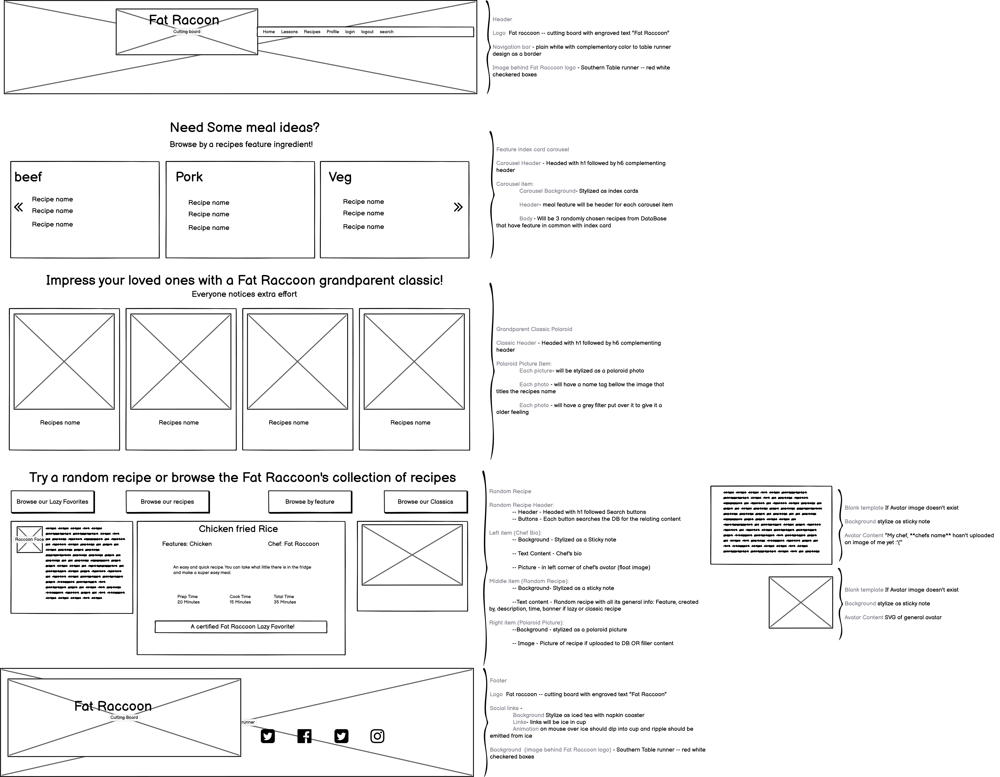

# Contents
[Fat Raccoon - Introduction](#fat-racoon-kitchen---introduction)

[UX](#ux)
+ [Goals](#goals)
    + [User Goals](#user-goals)
    + [Developer Goals](#developer-goals)
+ [Client Stories and Experience Provided](#client-stories-and-experience-provided)
    + [Client Stories](#client-stories)
    + [Experience Provided](#experience-provided)

[Design Choices](#design-choices)
+ [Header and Footer](#header-and-footer)
+ [Login and Create Account Modal](#login-and-create-account-modal)
+ [Index](#index)
+ [Lessons](#lessons)
+ [Profile](#profile)
+ [Recipe](#recipe)
+ [Recipe List](#recipe-list)
+ [All Recipes](#all-recipes)
+ [Add Edit Recipes](#add-edit-recipes)
+ [Edit User Info](#edit-user-info)
+ [Search Bar Returns](#search-bar-returns)
+ [Page Performance](#page-performance)
+ [Wireframe and Live Demo](#wireframe-and-live-demo)
    + [Wireframe](#wireframe)
    + [Live Demo](#live-demo)
+ [Scalability](#scalability)

[Technology Languages](#technology-languages)

[Testing](#testing)
+ [Developer Testing Specifications](#developer-testing-specifications)
    + [Developer Tested Systems](#developer-tested-systems)
    + [Developer Testing Methods](#developer-testing-methods)
+ [Developer Tests](#developer-tests)
+ [Program Tests](#program-tests)
    + [BrowserStack](#browserstack)
    + [Lighthouse](#lighthouse)
    + [JigSaw](#jigsaw)
    + [W3C Validator](#w3c-validator)
    + [JSHint](#jshint)

[Bugs and Other Problems](#bugs-and-other-problems)
+ [Previous Bugs](#previous-bugs)
+ [CurrentBugs](#current-bugs)
+ [Other Problems](#other-problems)

[Deployment](#deployment)
+ [Setup structure on GitPod for developers](#setup-structure-on-gitpod-for-developers)
    + [Flask](#flask)
    + [Pymongo](#pymongo)
+ [Deploy Clone from GitHub](#deploy-clone-from-github)
+ [Heroku Deployment](#heroku-deployment)
+ [Database build](#database-build)
    + [Database structure](#database-structure)
    + [Connecting to DB](#connecting-to-db)
    + [Create the appropiate collections](#create-the-appropiate-collections)

[Tools and Credits](#tools-and-credits)
+ [Tools](#tools)
+ [Credits](#credits)
    + [Code Citations](#code-citations)
    + [References and Ideas](#references-and-ideas)

+ [Acknowledgements](#acknowledgements)

# Fat Racoon Kitchen - Introduction
The Fat Racoon Kitchen is devoted to helping home cooks provide better meals to friends, family, and/or yourself. We provide a network of user uploaded 
recipies that can be searched through with our "Ingredience" or "Garbage" search, which is a favorite for our chefs. We stoutly believe that even 
without the ideal ingredience on hand, a little taste pairing or extra spice can help make any meal provide a savory experience. We eve go out of our way 
to provide new chefs with some basic cooking lessons in our lessons section. Our end goal is to help home chefs make the jump from recipe depentent to 
taste depentent. Our chefs know the importance of making the best out of what we have on hand 
and want to share that liberating experience with other home chefs.

The chefs of the Fat Racoon Kitchen started as sleep deprived, nocturnal home chefs that would use the "garbage", leftovers, or that one thing 
that has to be eatten today (Weve all done it) to make a meal. With practice and study these meals improved over time but it started with learning 
fundamental cooking practices and taste pairings. We want to help others wisely spend their kitchen time making the best meals they can. We offer 
conventional cooking practice and recipe guidance to help them along the way. The Fat Racoon Kitchen believes that helping to establish a community 
of home cooks and their recipies in an intuitive search engine will be a boon to home chefs everywhere. It helps newer chefs see that not every 
recipe has to be complicated or convoluted.

We offer a brief home cooking fundamental section this section can help home chefs make the best of the "garbage"(feature ingredient) they have to cook. Users can search 
recipes by feature ingredient to find that one recipe that they want to try. This can be accomplished through the use of our search bar or by searching through our recipe 
database.

For our home cooks that submit recipes, we offer a place to put in a recipes description, background, history, etc.... Cooking has more meaning than just preparing 
food. For many it is a connection to your history or life experience.  We encourage our users to give us a little history in the recipes they submit. 
Let us help preserve the history of a recipe. Its important to us and to those that submitted it. From a family recipe to this is all I could afford 
in college, let us know!

# UX
## Goals
### User Goals
+ I want to find a recipe for dinner.
+ I want to use my cell phone to look up a recipe.
+ I was to use a tablet as a "recipe book".
+ I want to make a pasta dish I dont know.
+ I want a place to leave a recipe so I can easiy find.
+ I want help deciding what to cook for dinner.
+ I want a easy to make recipe.
+ I want a recipe to surprise my significant other with
+ I want the aplication to remember a list of recipes I like
+ I want an easy to read recipe layout while Im cooking
+ I want a site that has a welcoming feeling

### Developer Goals
+ As a school project, this site was developed using as little 3rd party code as possible (ex. carousel logic was written by developer and bootstraps version was not used). This 
was a deliberate choice to help the developer gain a better understanding of how languages such as JS and python function and not done out of ignorance. Understanding the time it 
takes to develope such code is important.

+ I want to showcase my python abilities.
    + Datetime (python)
    + Flask (flash, render_template, redirect, request, session, url_for)
    + Jinja (Templates)
        + Allowing one page to have multiple functions
            + Add edit recipe
            + base - login/create modal
    + Python Day Time 
    + Pymongo (Flask - mongo DB)
    + Validation
    + Using callable functions over repeating code
    + Using if expressions: to replace blank sections(missing DB data) with filler Templates, to add the lazy banner on random recipe, etc...
    + Using for expressions: to generate list data ex. recipe lists, recipe ingredient lists, recipe step lists, etc...
    + Use random number generator to randomly pick recipes

+ I want to showcase my JS abilities
    + Created carousel JS logic
    + Created pagination JS logic
    + Created Validation JS logic
        + Character length
        + Compare two passwords to be sure they match
        + Make sure email has appropriate suffix
        + Replace spaces with _ using a regex

+ I want to showcase my DB abilites.
    + Mongo DB
        + Searches use restricted results
        + searches use operator if applicable
        + Building DB upload dictionary piece by piece for edits rather than always relying on a generic upload template
        + Allow users to upload images (avatar)
    + Pymongo (Flask - mongo DB)

+ I want to showcase my artistic ability
    + css art
        + Sticky Notes with lifting effect
        + Social Drinks (Links) - stylized as a drink with ice in it with a ripping and ice dipping effect 
        + Polaroid Picture
        + Table Runner(Header footer)
    + svg art** favicon - blank place holder - arrow for carousel

## Client Stories and Experience Provided
### Client Stories

### Experience Provided
+ Users can search the entire recipe DB for the recipe they want to use
+ Have a "random recipe" from the Fat Raccoon chefs for those that dont know what they want.
+ Site is fully responsive so users can use recipes on their phones or tablets while cooking.
+ Site allows for users to "scratch through" ingredients or steps on recipe page as they gather or accomplish parts
+ Users can use user search bar to search for features (also for: chef name and recipe name)
+ Users can upload their own recipes to have a safe place to keep a recipe they like
+ Users can use carousel, grnadparent classics or random recipe to help get an idea what to cook
+ Users search results returns total time it takes to cook a meal 
+ Grandparent classic was designed to offer users a choice of recipes that are considered classical in the Fat Raccoon
+ Recipe pages layout is designed specifically for mobile and tablet users.  Providing the best UX possible
+ Site has a welcoming southern homecooking feeling

# Design Choices
## Header and Footer
+ Southern theme
    + Cutting board logo with engraved text
    + Southern table runner fot background
    + Links are stylized drinks
+ Plan easy to see nav bar
+ search bar is collapsed in nav bar

## Login and Create Account Modal
+ Both login and create account combined into single modal to save space
+ validation prevents users from submitting improper form details
+ validation also automatically adds '_' in place of a space

## Index
+ index card carousel
    + Recipes added to index cards for a home made, I can do this feeling
    + carousel offers three ransomly selected recipes from head chef to display per feature item
    + Designed to help give users options based on the feature item they wayt to cook
+ Grandparent classic polaroids
    + Recipe's image used on a polaroid picture design with a grey filter to give them a 'classic' appearance
    + The design is used to give people the nostalgia feeling of a recipe their grandparents might have made
    + The recipe's name is added to the bottom of the picture to let users know what recipe they are viewing
+ Random Recipe section
    + Quick browsing links provided to give users ample ideas if they dont know what to cook
    + A random recipe with basic information and a image is provided to give users an idea of what to cook
    + This is followed with a banner if the recipe is a lazy favorite, grandparent classic, or both
    + This section also houses the head chef's Bio and image to help give the site a welcoming feeling

## Lessons
+ A simple header that lets users know the cards are clickable was used
+ Index cards
    + Each index card is flippable with most of them containing information on both sides
    + The information provided gives new chefs some hints and tricks at getting started in the kitchen and making the best of what they have on hand

## Profile
+ Two clean buttons on top that allow users to either create a recipe they want to preserve  or update their own profile
+ Users can clearly see their own bio and avatar image
+ Users have access to their entire uplaoded/favorited recipe history with a single click
    + Users can also see their ten most recently uploaded/favorited as well
+ Users can see their 10 recently viewed recipes 

## Recipe
+ If a user has submitted a recipe they view:
    + They can modify or delete that recipe
+ Logged in users:
    + Can favorite a recipe so they can return to it easier
+ clearly displays avatar image so users can see what dish looks like
+ All general recipe information is displayed and easiy viewed
+ Recipe's ingredients and steps: 
    + each labeled in their own lists
    + Each item has its own check box
    + Users can click on any part of the item and it will check the box and cross out the item clicked

## All Recipes
+ Lists entire DB of recipes by their featured ingredient
+ When a feature contains more than 5 entires the list updates to have pagination at the bottom of the list
+ Each list is given a header of the feature type that is the basis for which recipes follow
+ Each Recipe displays the name and total recipe time to help users decide what they want to make

## Recipe List
+ When a list contains more than 5 entires the list updates to have pagination at the bottom of the list
+ Each Recipe displays the name and total recipe time to help users decide what they want to make

## Add Edit Recipes
+ A form that is less frills than the rest of the page.  This is to give a more serious feeling when creating/editing recipes
+ Users can update every part of a recipe except the boolean tags: Lazy Favorite and Grandparent Classic (Which is reserved for the HeadChef of the site to make this decision)
+ There is basic HTML validation for the form except for the recipe image which has an additional level of validation to prevent users from upload to large of an image
+ Total cook time updates automatically as prep and cook times are adjusted
+ Recipe Ingerdients and Recipe Steps:
    + Each uses a JS add/remove set of buttons for users to create and remove boxes as they need
    + Each box is numbered to help users keep track of the step they are at
    + The header keeps an active count of visible boxes so users know how many are visible

## Edit User Info
+ A form that is less frills than the rest of the page.  This is to give a more serious feeling when creating/editing recipes
+ Uses are able to update their password, username, email, avatar, and bio
+ JS Character # validation is used on name
+ JS email validation 
    + Email validation is limited with suffixes allowed
    + checks for the email suffix .com or .edu
    + This is detailed in **previous bugs** section
+ Users wishing to create a new password, must click on the create new password button. This keeps users from accidently invalidating the form by starting its validation
+ New password validation is JS and uses must type the same password into both boxes

## Search Bar Returns
+ This page is used to return 3 different search results
+ it returns:
    + all user searches from search bar: for recipe name, feature, and chef
    + Profile page searches: all uplaoded, favorited, and recently viewed sections
    + Index browse buttons for grandparent classics and lazy favorites

## Page Performance

## Wireframe and Live Demo
### Wireframe

+ [Balsamiq](https://balsamiq.com/) was used for the planning process.
+ Wireframes were made for all predetermined size variations of the webpage.
+ Each wireframe contains curly brackets that give a description of its contents.
+ [Click here to view all wireframes associated to this project.](static/readme/wireframe "Location of wireframes")

### Live Demo

+ A fully functioning demo can be found on Heroku, [here](https://fat-raccoon.herokuapp.com/ "Deplayment location").
+ [GitHub's](https://github.com/) IDE [GitPod](https://www.gitpod.io/) was used for the construction process.
+ GitHub houses the master branch, [here](https://github.com/Richardaeld/Fat_Racoon_Kitchen)

## Scalability
+ Add ability to search for lazy or grandparent classic
+ backend varify of image size and type instead of JS validation
+ Adding user selectable filters to search bar
+ Create a user commit form for the recipes. This would give a better sense of community for returning users
+ Allows users to rate each others recipes
+ Improve email validation to accept a wider ranger of email suffixes (ex. regional suffix, .uk, .fr, .de)

# Technology Languages
+ HTML - Skeleton frame of the application.
+ CSS - Beautifies the skeleton (HTML).
+ JavaScript - Allows for dynamic content on the application.
+ Python - Allows back end programs to run. These programs are:
    + Flask - Allows use of Templating, security, user searching, and other critical functions.
    + Pymongo - Allows flask (python) to communicate with Mongo DB.
    + PythonDNS
    + Werkzeug - Encrypts data as it is sent between the user and server.
    + Datetime - Allows python to take a date/time stamp.
    + Random - Allows a for a random number generator.
+ Mongo DB - Database that application communicates with and stores information on.

# Testing
## Developer Testing Specifications
### Developer Tested Systems
+ Windows 10 (Chrome 87**, Edge 87**, Firefox 84**)
    + Chrome
        + Developed in Chrome
        + Initially tested in every bootstrap breakpoint during development.
        + Tested in landscape, which is desktop responsiveness level.
        + Tested in portrait, which is tablet responsiveness level.
    + Edge
        + Tested in landscape, which is desktop responsiveness level.
        + Tested in portrait, which is tablet responsiveness level.
    + Firefox
        + Tested in landscape, which is desktop responsiveness level.
        + Tested in portrait, which is tablet responsiveness level.
+ G8 ThinQ (Chrome 87**)
    + Chrome
        + Tested in landscape, which is desktop responsiveness level.
        + Tested in portrait, which is tablet responsiveness level.
+ iPad, 5th gen 13.3(Safari 13**)
    + Safari
        + Tested in landscape, which is desktop responsiveness level.
        + Tested in portrait, which is tablet responsiveness level.

### Developer Testing Methods
+ Every test of **Developer Tests** was preformed on the above listed systems ar the specified screen orientation.
+ Between landscape and portrait tests, the application was not refreshed. This is a critical part of the test! Part of these tests is that the application is **never** 
refreshed between tests. This helps test for stability and ensure tablet and mobile users a good experience.
+ After completion of all of the **Developer Tests** on each system, the system was tested again with random moments of spam clicking and switching between landscape/portrait. 

## Developer Tests

## Program Tests
### BrowserStack

### Lighthouse

### JigSaw
+ Identifies errors in CSS

### W3C Validator
+ Identifies errors in HTML

### JSHint
+ Identifies errors in JS

# Bugs and Other Problems
## Previous Bugs
+ Flask was generating a 504 gateway timeout error
    + A previously harmless while began to loop infinitely when a if comparason value was improper
    + Fix was being sure the if comparason values were both int, previously one had been a html location because of a missed len
+ Carousel would put up improper amount of items when changing from landscape to portrait.
    + The carousel 'memory' array and position had to be completely reset each time the screen switched between landscape and portrait.
+ Corner of napkin css art was improper size in safari
    + Had to add -webkit- to clip-path for saafari
+ index card art had jagged edges after transform: rotateY(180deg) was applied.
    + Fix was a recommended line of code -webkit-backface-visibility:hidden -- reccomdation found here https://stackoverflow.com/questions/6492027/css-transform-jagged-edges-in-chrome
+ Needed a nonstandard shapped container to hold a repeating linear gradient.
    + Found solution at MDN using a clip-path:polygon https://developer.mozilla.org/en-US/docs/Web/CSS/clip-path 
+ Program wouldnt upload to heroku properly
    + Fix was to add the missing space after colon in Procfile
+ Numerous occasions used unspecific python if arguments leading to undesired and often difficult to find Bugs
    + Ex. without specific arguments incorrect add edit recipe page would not edit recipes it would only generate new recipes
    + An extra operator and arguemnt was added to all if post conditions
+ Email wouldnt JS validate properly
    + Type: email was preventing the regex from functioning properly.
    + Fix was changing type to text and added an extra layer of validation to email, email suffix
+ Login modal wouldnt operate appropiately on any page other than the index
    + Login modal was added to base and removed from index
    + base_login was created to replace base for pages user had to be logged in for and needed the modal to NOT be present

## Current Bugs
+ Social links on footer have a triggering bug. They use JS mouseenter to trigger and trigger improperly due to multiple css layers and a margin. The margin is persisting through multiple
techniques to remove it, including !important. Changing the layer or to mouseover does not fix the excessive triggering. 
+ User search box, on medium and small responsiveness, creates a line below the main navigation bar and drops the search bar down to that new line 
    + A Solution to have search bar collapse has been attempted however this generated poor UX and various targeting bugs 
+ Safari browser Bugs
    + When safari decides sticky-note-right's height is to large the box shadow of its :before has a layer error and overlaps the content of sticky-note-right
    + Input of user search bar is larger than it should be, giving the item bad UX

## Other Problems
+ Email validation
    + Validation origianlly used suffix validation of ".com" and ".edu". However this validation alienated users from making accounts  
    + Suffix validation had to be expanded to include ".net" and ".org".
+ Searching mongo DB using collection.db.find("$text": "$search": <value>) unable to return booleans.  This is an issue with users being 
able to search "lazy" or "grandparent" tags. 

# Deployment
## Setup structure on GitPod for developers
### Flask
+ install Flask
    + in bash type "pip3 install Flask"
+ python file structure
    + create "*name*.py" file in root 
    + create "env.py" file in root
        + Add "env.py" to "gitignore" list (NEVER PUSH THIS FILE)
        + Add "__pycache__/" to "gitignore" list (NEVER PUSH THIS FILE)

### PyMongo
+ install PyMongo
    + in bash type "pip3 install flask-pymongo"
    + in bash type "pip3 install dnspython"

## Deploy Clone from GitHub

## Heroku Deployment
+ create app on Heroku
+ Files for heroku from GitPod
    + in bash "pip3 freeze --local > requirements.txt
    + in bash "echo web: python run.py > Procfile"
        + If the opened Procfile has a blank line at the bottom, delete this line. It could cause problems with Heroku otherwise.
    + this creates two files for heroku to identify what it needs to run app
+ link Heroku and GitHub
    + From personal > *name of app* created at first Setup
    + select (go to) deploy
    + select GitHub from 'deployment method' section
    + from your GitHub account and the name of the cloned repository
+ Share env.py information with heroku
    + select (go to) settings
    + click reveal config vars of config vars
    + add all of the 'os.environ.setdefault' key value pairs without their quotations
+ Enable automatic deployment
    + select (go to) deploy
    + select 'automatic deploys' in 'automatic deploys' section
    + select 'deploy branch' in 'manual deploy' section

## Database build
### Database structure
+ create Database on MongoDB
+ create collections for Database: feature, recipes, users
+ add featured items to feature as format: {name:feature} features will be you meal star (ex. protein, veg, pasta)
+ create index (**notes**)
    + in bash "python3"
    + in bash "from *app name* import mongo"
    + mongo.db.*collection*.create_index([("name", "text"), ("name2","text")])
### Connecting to DB
+ find URI
    + go to cluster
    + select 'connect'
    + select 'connect your application'
    + select driver (python) and version of python
    + copy string provided
    + paste string in env.py as the "MONGO_URI" value
    + Update the pasted string with the DBname and password by replacing <DBname> and <password> (replace angled brackets as well)
### Create the appropiate collections
+ feature
    + Feature is for a recipes feature ingredient
    + There must be a single feature in the collection for the page to function
    + each feature is structured as 
        + {
        + name: "chicken"
        + }
+ recipes
    + Recipe is where the sites recipes are stored
    + There must be a single recipe in the collection for page to function and it must be linked with lead chefs for recipe of the day to function**May have updated to accept no recipes
    + each recipe is structured as
        + {
        + name: "recipe name",
        + feature: "chicken",
        + ingredients: ["ingredient1", "ingredient2", "ingredient3", etc...],
        + steps: ["step1", "step2", "step3", etc...],
        + time: [15, 20, 35],
        + text: "Some general information about this recipe",
        + date: *python time stamp*,
        + avatar: null,
        + avatar_id: null,
        + created_by: "someonesEmail@aol.com",
        + grandparent: false,
        + lazy: false
        + }
+ users
    + Users is where the sites user information is stored
    + each user must be structured as
        + {
        + username: "some_name",
        + email: "Email@gmail.com",
        + password: "*hashed password*",
        + avatar: null,
        + avatar_id: null,
        + bio: "",
        + admin: false
        + recent: [],
        + favorites: [],
        + date: *python tim stamp*
        + }
+ fs.chunks
    + Will be created automatically after first image is uploaded
    + fs.chunks is for storage of images
+ fs.files 
    + Will be created automatically after first image is uploaded
    + fs.files is for storage of images

# Tools and Credits
## Tools
+ [Balsamiq](https://balsamiq.com/)
    + Used to produce the wireframes.
+ [Bootstrap](https://getbootstrap.com/)
    + Used as framework.
+ [BrowserStack](https://www.browserstack.com/)
    + Used to check for compatibility errors.
+ [GitHub](https://github.com/)
    + Used for version control and deploys application information to Heroku.
+ [GitPod](https://www.gitpod.io/)
    + Integrated development environment used.
+ [Google Fonts](https://fonts.google.com/)
    + Imported font families from here.
+ [Heroku](https://www.heroku.com/)
    + Site where application is deployed.
+ [Jigsaw (Validation Service)](https://jigsaw.w3.org/css-validator/)
    + Used to identify errors in CSS.
+ [JSHint](https://jshint.com/)
    + Used to identify errors in JavaScript.
+ [Lighthouse](https://developers.google.com/web/tools/lighthouse)
    + Used to check for performance, accessibility, best practices, and SEO.
+ [Pingdom](https://tools.pingdom.com/)
    + Used to check load time.
+ [Techsini](https://techsini.com/multi-mockup/)
    + Used for their viewable responsiveness PNG.
+ [TinyPNG](https://tinypng.com/)
    + Used to Minimize KB load per image.
+ [W3C Validator](https://validator.w3.org/)
    + Used to identify errors in markup.
+ [JSFiddle](https://jsfiddle.net/)
    + Used for tinkering and creating CSS art. 
+ [Inkscape](https://inkscape.org/)
    + Used to create scalable vector graphics (SVG).
+ [RandomKeygen](https://randomkeygen.com/)
    + Used to create random secret key for "env.py"

## Credits
### Code Citations
+ [Pretty Printed](https://www.youtube.com/watch?v=DsgAuceHha4) - how to upload images to MongoDB

### References and Ideas
+ [Bootstrap](https://getbootstrap.com/)
    + Framework used to help speed up development and provide a better overall UX.
+ [Flask](https://flask.palletsprojects.com/en/1.1.x/)
    + A basic guide to the current version of Flask.
+ [MDN Web Docs](https://developer.mozilla.org/en-US/)
    + Invaluable source of information about JavaScript, HTML, and CSS.
+ [PyMongo](https://pymongo.readthedocs.io/en/stable/)
    + A basic guide to the current version of PyMongo
+ [Stack Overflow](https://stackoverflow.com/)
    + Great souce of information for finding a starting place and direction to research.
+ [TestLodge](https://blog.testlodge.com/how-to-write-test-cases-for-software-with-sample/)
    + Used to help formulate test syntax structure.
+ [W3Schools](https://www.w3schools.com/)
    + Extremely helpful for explaining base HTML, CSS, and JavaScript principles.
+ [Werkzeug](https://werkzeug.palletsprojects.com/en/1.0.x/)
    + A basic guide to the current version of Werkzeug.
+ [World Wide Web Consortium (W3C)](https://www.w3.org/)
    + Used to understand basic standardization practices for web based apps.
    
# Acknowledgements