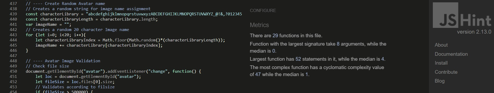

# Contents
[Testing](#testing)
+ [Developer Testing Specifications](#developer-testing-specifications)
    + [Developer Tested Systems](#developer-tested-systems)
    + [Developer Testing Methods](#developer-testing-methods)
+ [Developer Tests](#developer-tests)
    + [Testing Random Recipe](#testing-random-recipe)
    + [Testing Text Coss Out Function](#testing-text-coss-out-function)
    + [Testing All_Recipe And Recipe_List Pagination](#testing-all_recipe-and-recipe_list-pagination)
    + [Testing Recipe Upload](#testing-recipe-upload)
    + [Testing Search Chef Name](#testing-search-chef-name)
    + [Testing Browse Button for Lazy Favorites Recipes](#testing-browse-button-for-lazy-favorites-recipes)
    + [Testing Recipe Favorites Function](#testing-recipe-favorites-function)
    + [Testing Index Cards on Lesson Page](#testing-index-cards-on-lesson-page)
    + [Testing Profile Updates](#testing-profile-updates)
    + [Testing Delete Recipe - Full C.R.U.D. Test](#testing-delete-recipe---full-c.r.u.d.-test)
    + [Testing Delete Button for Recipes on Profile Page](#testing-delete-button-for-recipes-on-profile-page)
+ [Program Tests](#program-tests)
    + [BrowserStack](#browserstack)
    + [Lighthouse](#lighthouse)
    + [JigSaw](#jigsaw)
    + [W3C Validator](#w3c-validator)
    + [JSHint](#jshint)
+ [Return to README](#return-to-readme)

# Testing
## Developer Testing Specifications
### Developer Tested Systems
+ Windows 10 (Chrome 87**, Edge 87**, Firefox 84**)
    + Chrome
        + Developed in Chrome.
        + Initially tested in every bootstrap breakpoint during development.
        + Tested in landscape, which is desktop responsiveness level.
        + Tested in portrait, which is tablet responsiveness level.
    + Edge
        + Tested in landscape, which is desktop responsiveness level.
        + Tested in portrait, which is tablet responsiveness level.
    + Firefox
        + Tested in landscape, which is desktop responsiveness level.
        + Tested in portrait, which is tablet responsiveness level.
+ G8 ThinQ (Chrome 87**)
    + Chrome
        + Tested in landscape, which is tablet responsiveness level.
        + Tested in portrait, which is Mobile responsiveness level.
+ iPad, 5th gen 13.3(Safari 13**)
    + Safari
        + Tested in landscape, which is tablet responsiveness level.
        + Tested in portrait, which is tablet responsiveness level.

### Developer Testing Methods
+ Every test of **Developer Tests** was performed on the above listed systems and the specified screen orientation.
+ The tester will perform each test of **Developer Tests** three times: 
    + Once in landscape.
    + Once in portrait.
    + Once with random moments of spam clicking and switching between landscape/portrait. This final test is critical to ensure tablet and mobile users have an enjoyable experience.

## Developer Tests
### Testing Random Recipe

---

#### User Story
+ I want to find a recipe for dinner. <!-- Testing Random Recipe -->

#### Expectation(s):
1. The recipe displayed in random recipe is actually random.
1. The random recipe's banner functions correctly.
1. The page content fills appropriately and doesn't spill out beyond obvious borders.
1. The page content doesn't overlap and is easy to read.

#### Assumption(s):
1. The tester will keep performing this test until they see a classic banner, a favorite banner, and a favorite/classic banner.
1. The tester has a list of recipes that contain the favorite, classic, and favorite/classic boolean tag.

#### Testing Step(s):
1. Load the **Index Page** of the Fat Raccoon.
1. Scroll to the bottom of the page.
1. Click the **random recipe** to make sure it links to the proper recipe.
1. Repeat steps 1 - 3 approximately five times to check for randomization of recipe.

#### Document Result(s):
1. If any links are broken, record:
    + The test name, recipe name, and a brief description of the problem.
1. If any recipe displays an incorrect banner, record:
    + The test name, recipe name, banner anticipated, banner displayed, and a brief description of the problem.
1. If any content has bad UX, record:
    + The test name, recipe name, screen resolution, browser/device, page (Jinja template), and a brief description of the bad UX.
1. If there is an incorrect box shadow, record:
    + The test name, recipe name, screen resolution, browser/device, page (Jinja template), and a brief description of the incorrect box shadow.

### Testing Text Cross Out Function

---

#### User Story
+ I want to use my smart phone or tablet as a recipe book. <!-- Testing Text Coss Out Function -->

#### Expectation(s):
1. The content of the **Recipe Steps** and **Recipe Ingredients** sections will cross out correctly.
1. The page content fills appropriately and doesn't spill out beyond obvious borders.
1. The page content doesn't overlap and is easy to read.

#### Assumption(s):
1. The tester knows the size for each clickable area that causes the cross out effect and will be choose a different place to click every time.
1. The tester knows multiple ways to get to a recipe's page.
1. The tester is not repeatedly using the same path to a recipe page.

#### Testing Step(s):
1. Load the **Index Page** of the Fat Raccoon.
1. Navigate to a recipe page of the testers choosing.
1. Scroll to the **Recipe Ingredients** section and click a check box or text to see if it crosses out correctly.
1. Scroll to the **Recipe Steps** section and click a check box or text to see if it crosses out correctly.
1. Repeat steps 2 - 4 approximately three times. (Choose a different path to the recipe page each time or until all known paths are used).

#### Document Result(s):
1. If the content from the **Recipe Steps** or **Recipe Ingredients** sections does not cross out properly, record:
    + The test name, recipe name, **Recipe Steps** and/or **Recipe Ingredients** (which ever one was problematic), and a brief description of the problem.
1. If any links are broken, record:
    + The test name, recipe name, choice of path to said recipe, and a brief description of the problem.
1. If any content has bad UX, record:
    + The test name, recipe name, screen resolution, browser/device, page (Jinja template), and a brief description of the bad UX.
1. If there is an incorrect box shadow, record:
    + The test name, recipe name, screen resolution, browser/device, page (Jinja template), and a brief description of the incorrect box shadow.

### Testing All_Recipe and Recipe_List Pagination

---

#### User Story
+ I want to find a new chicken dish to cook. <!-- Testing All_Recipe And Recipe_List Pagination-->

#### Expectation(s):
1. Pagination appears when it's supposed to.
1. Pagination doesn't obscure any content.
1. The page content fills appropriately and doesn't spill out beyond obvious borders.
1. The page content doesn't overlap and is easy to read.

#### Assumption(s):
1. The tester will create dummy recipes for this test (if necessary) and keep a record of the dummy recipes.

#### Testing Step(s):
1. Load the **Index Page** of the Fat Raccoon.
1. Click on **Recipes** on the navigation bar. (This is the Jinja template, **All_Recipes**)
1. Find any featured ingredient container that contains a pagination `ul` (or make some recipes to trigger pagination).
1. Click through five random pagination numbers of the pagination `ul`.
1. Repeat step 4, for one other featured ingredient with a pagination `ul`.
1. Find any featured ingredient container with a pagination `ul` and click on the **Featured Ingredient** header. (This will open the Jinja template, **Recipe_List**.)
1. Click through five random pagination numbers of the pagination `ul`.
1. Repeat steps 2, 6, and 7 approximately one time.

#### Document Result(s):
1. If a user account was created to fulfill the test's requirements, record:
    + The username, email address of the account, and that this is a test account.
1. If any recipe dummy data was created to fulfill the test's requirements, record:
    + The names of all of the recipes created, the username of the account that created the recipes, and that they are all dummy data.
1. If any pagination has bad UX, record:
    + The test name, recipe name, featured ingredient, screen resolution, browser/device, page (**All_Recipes** or **Recipe_List**), pagination number, and a brief description of the problem.
1. If any content has bad UX, record:
    + The test name, recipe name, screen resolution, browser/device, page (Jinja template), and a brief description of the bad UX.
1. If there is an incorrect box shadow, record:
    + The test name, recipe name, screen resolution, browser/device, page (Jinja template), and a brief description of the incorrect box shadow.

### Testing Recipe Upload

---

#### User Story
+ I want a place to leave a recipe, so I can easily find it later. <!-- Testing Recipe Upload -->

#### Expectation(s):
1. The recipe uploads without error.
1. The recipe displays correctly on its page.
1. The page content fills appropriately and doesn't spill out beyond obvious borders.
1. The page content doesn't overlap and is easy to read.

#### Assumption(s):
1. The tester will intentionally try to submit incorrect data to check for incorrect validation.
1. The tester will create an account for this test, and will keep a record of the account.
1. The tester has a PNG or JPG image under 500kb, a PNG or JPG image over 500KB, a non-PNG or JPG image file under 500KB, and a non-PNG or JPG image file over 500KB.
1. The tester knows the difference between JS and Python validation.
1. The tester knows what this form considers invalid and will check every part of the validation. (Example, max character, min character, spaces, characters, etc....)

#### Testing Step(s):
1. Load the **Index Page** of the Fat Raccoon.
1. Click on **Login** on the navigation bar.
1. Click on the **Create Account** tab.
1. Fill out all the appropriate information and click submit.
1. Once the **Profile** page is loaded, click on the **Share Recipe** button.
1. Fill out all the appropriate information, including an avatar, and click submit.
1. Once the new recipe page is loaded, check over the newly created recipe for all appropriate information.
1. Navigate back to the **Profile** page and click on the **Share Recipe** button.
1. Fill out the form with all appropriate information, including an avatar.
1. Choose one element of the form to incorrectly fill out and attempt to submit.
1. Repeat step 10 until each of the form's user inputs (recipe name, prep time, cook time, recipe description, recipe ingredients, and recipe steps) have had their validation tested. 
1. Attempt to submit the same recipe with a PNG or JPG image over 500KB, a non-PNG or JPG image file under 500KB, and a non-PNG or JPG image file over 500KB.
1. Return to the original submitted recipe's page.
1. Click on the **Edit Recipe** button.
1. Repeat steps 9 - 12.

#### Document Result(s):
1. A user account was created to fulfill the test's requirements, record:
    + The username, email address of the account, and that this is a test account.
1. If any form of validation fails, record:
    + The test name, any input/textarea that incorrectly accepted or refused information, what form of validation failed (type of validation and if was JS and/or Python), if it was a new recipe or edited recipe, and a brief description of the problem.
1. If any content has bad UX, record:
    + The test name, recipe name, screen resolution, browser/device, page (Jinja template), and a brief description of the bad UX.
1. If there is an incorrect box shadow, record:
    + The test name, recipe name, screen resolution, browser/device, page (Jinja template), and a brief description of the incorrect box shadow.

### Testing Search Chef Name

---

#### User Story
+ I want help deciding what to cook for dinner and I like a specific chef's recipes. <!-- Testing Search Chef Name -->

#### Expectation(s):
1. Searching by chef name will return the correct information.
1. The page content fills appropriately and doesn't spill out beyond obvious borders.
1. The page content doesn't overlap and is easy to read.

#### Assumption(s):
1. Tester knows all the recipes that belong to the chef Fat_Raccoon.

#### Testing Step(s):
1. Load the **Index Page** of the Fat Raccoon.
1. Click on the navigation bar's search bar.
1. Input, "Fat_Raccoon" into the search bar and submit.
1. Check over the returns to make sure all appropriate returns are shown.
1. Return to the **Index Page** of the Fat Raccoon.
1. Scroll to the bottom of the page, where the **Random Recipe** is located.
1. Click on the chef's name, Fat_Raccoon, which is under the recipe's name.
1. Check over the returns to make sure all appropriate returns are shown.
1. Return to the **Index Page** of the Fat Raccoon.
1. Scroll to the bottom of the page, where the **Random Recipe** is located.
1. Find the sticky note with **Head Chef** on it and click on the text, Fat_Raccoon, which is at the bottom of that sticky note.
1. Check over the returns to make sure all appropriate returns are shown.
1. Select any recipe from the chef Fat_Raccoon and go to that recipe's page.
1. Under the avatar image, click on the name, Fat_Raccoon.
1. Check over the returns to make sure all appropriate returns are shown.
1. Return to the **Index Page** of the Fat Raccoon.
1. Scroll to the bottom of the page, where the **Random Recipe** is located.
1. Click on the **Browse Fat_Raccoon Recipes** button.
1. Check over the returns to make sure all appropriate returns are shown.

#### Document Result(s):
1. If there is any broken links or incorrect recipe returns, record:
    + The page (Jinja template), location on the page where the link can be found, and a brief description of the problem.
1. If any content has bad UX, record:
    + The test name, recipe name, screen resolution, browser/device, page (Jinja template), and a brief description of the bad UX.
1. If there is an incorrect box shadow, record:
    + The test name, recipe name, screen resolution, browser/device, page (Jinja template), and a brief description of the incorrect box shadow.

### Testing Browse Button for Lazy Favorites Recipes

---

#### User Story
+ I want an easy-to-make recipe. <!-- Testing Browse Button for Lazy Favorites Recipes -->

#### Expectation(s):
1. All recipes with the lazy favorite boolean tag are returned.
1. The page content fills appropriately and doesn't spill out beyond obvious borders.
1. The page content doesn't overlap and is easy to read.

#### Assumption(s):
1. Tester knows all recipes tagged as lazy favorite.

#### Testing Step(s):
1. Load the **Index Page** of the Fat Raccoon.
1. Scroll down to the **Random Recipe** section.
1. Click on the button **Browse our Lazy Favorites!**.
1. Check over the returned recipes to make sure all appropriate recipes are shown.

#### Document Result(s):
1. If any lazy favorite recipes are not shown or non-lazy favorite recipes are shown, record:
    + Any lazy favorite recipes that are missing, incorrect recipes that have shown up, and a brief description of the problem. 
1. If any content has bad UX, record:
    + The test name, recipe name, screen resolution, browser/device, page (Jinja template), and a brief description of the bad UX.
1. If there is an incorrect box shadow, record:
    + The test name, recipe name, screen resolution, browser/device, page (Jinja template), and a brief description of the incorrect box shadow.

### Testing Recipe Favorites Function

---

#### User Story
+ I can't remember the name of a recipe that I liked on the Fat Raccoon, and I want to find it again. <!-- Testing Recipe Favorites Function -->

#### Expectation(s):
1. The favorite icon responds appropriately to recipe status of favorite and unfavorite.
1. The page content fills appropriately and doesn't spill out beyond obvious borders.
1. The page content doesn't overlap and is easy to read.

#### Assumption(s):
1. The tester will create an account for this test and will keep a record of this account.
1. The tester knows the difference between the two icons: favorite recipe and an unfavorite recipe.
1. The tester will favorite and unfavorite a recipe using a random part of its click box.

#### Testing Step(s):
1. Load the **Index Page** of the Fat Raccoon.
1. Click on **Login** on the navigation bar.
1. Click on the **Create Account** tab.
1. Fill out all the appropriate information and click submit.
1. Navigate to any recipe of the tester's choice.
1. Click on **Not a Favorite** or its icon.
1. Check to be sure the correct text and icon appear.
1. Navigate to a different non favorited recipe page.
1. Click on **Not a Favorite** or its icon.
1. Check to be sure the correct text and icon appear.
1. Navigate to the **Profile** page.
1. Click on any favorited recipe in the **10 Recently Favorited Recipes** section and go to that recipe's page.
1. Check for the appropriate favorite status and icon.
1. Click on **Favorite** or its icon.
1. Check for appropriate favorite status and icon.
1. Navigate to the **Profile** page.
1. Click on the header for the **10 Recently Favorited Recipes** section.
1. Check for the appropriate recipe(s).

#### Document Result(s):
1. A user account was created to fulfill the test's requirements, record:
    + The username, email address of the account, and that this is a test account.
1. If the favorite status or icon is displayed incorrectly, record:
    + The test name, recipe name, path taken to the recipe, and a brief description of the problem.
1. If the click box for changing the favorite status does not respond correctly, record:
    + The test name, recipe name, and a brief description of the problem.
1. If any content has bad UX, record:
    + The test name, recipe name, screen resolution, browser/device, page (Jinja template), and a brief description of the bad UX.
1. If there is an incorrect box shadow, record:
    + The test name, recipe name, screen resolution, browser/device, page (Jinja template), and a brief description of the incorrect box shadow.

### Testing Index Cards on Lesson Page

---

#### User Story
+ I lack confidence in my cooking ability and need help. <!-- Testing Lessons Index Cards -->

#### Expectation(s):
1. Index cards rotate appropriately and have a good UX.
1. The page content fills appropriately and doesn't spill out beyond obvious borders.
1. The page content doesn't overlap and is easy to read.

#### Assumption(s):
1. The tester knows that every index card with two sides of information displays the text **More on back-->**.
1. The tester knows the content of each **Lesson** card.

#### Testing Step(s):
1. Load the **Index Page** of the Fat Raccoon.
1. Click on **Lesson** on the navigation bar.
1. Click every single index card and make sure the text is appropriately displayed on both sides.

#### Document Result(s):
1. If text is present on both sides of the index card and **More on back-->** is missing from the face, record:
    + The test name, the header of the index card, and a brief description of the problem.
1. If any index card has poor UX, record:
    + The test name, the side it was experienced on, the header of the index card, the resolution, browser/device used, and a brief description of the problem.
1. If any content has bad UX, record:
    + The test name, recipe name, screen resolution, browser/device, page (Jinja template), and a brief description of the bad UX.
1. If there is an incorrect box shadow, record:
    + The test name, recipe name, screen resolution, browser/device, page (Jinja template), and a brief description of the incorrect box shadow.

### Testing Profile Updates

---

#### User Story
+ I've decided that I don't like my user bio or avatar anymore and I want to change them. <!-- Tests update of user information/avatar -->

#### Expectation(s):
1. A Fat Raccoon account can be logged in with a newly changed password.
1. A user account can be created and modified.
1. The page content fills appropriately and doesn't spill out beyond obvious borders.
1. The page content doesn't overlap and is easy to read.

#### Assumption(s):
1. The tester will create an account for this test and will keep a record of the account.

#### Testing Step(s):
1. Load the **Index Page** of the Fat Raccoon.
1. Click on **Login** on the navigation bar.
1. Click on the **Create Account** tab.
1. Fill out all the appropriate information and click submit.
1. Click on the **Update Profile** button.
1. Click on the **Create New Password** button.
1. Upload an avatar, enter a bio, the current password, a new email, a new username and change the accounts password. Then submit all the data.
1. View all submitted data and check for accuracy.
1. Click on **Logout** on the navigation bar.
1. Click on **Login** on the navigation bar and enter new login information.
1. Click on the **Update Profile** button.
1. Upload a new avatar, a new bio, the current password, and submit.
1. View all submitted data and check for accuracy.

#### Document Result(s):
1. A user account was created to fulfill the test's requirements, record:
    + The current username and email address of the account (labeled as current), the previous username and email address (labeled as previous), and that this is a test account.
1. If any user profile content does not update properly, record:
    + The test name, the header of the content that does not update correctly and a brief description of the problem.
1. If unable to log back into the test account, record:
    + The test name, the current username and email address of the account (labeled as current), the previous username and email address (labeled as previous), and a brief description of the problem.
1. If any content has bad UX, record:
    + The test name, recipe name, screen resolution, browser/device, page (Jinja template), and a brief description of the bad UX.
1. If there is an incorrect box shadow, record:
    + The test name, recipe name, screen resolution, browser/device, page (Jinja template), and a brief description of the incorrect box shadow.

### Testing Delete Recipe - Full C.R.U.D. Test

---

#### User Story
+ I've uploaded a recipe I don't like anymore and I want to remove it. <!-- Tests for deletion of recipe --><!-- Tests C.R.U.D. -->

#### Expectation(s):
1. A recipe will be created, viewed, edited, and deleted.
1. A missing recipe message is flashed when a user tries to view a deleted recipe.
1. The page content fills appropriately and doesn't spill out beyond obvious borders.
1. The page content doesn't overlap and is easy to read.

#### Assumption(s):
1. The tester will create an account for this test and will keep a record of the account.

#### Testing Step(s):
1. Load the **Index Page** of the Fat Raccoon.
1. Click on **Login** on the navigation bar.
1. Click on the **Create Account** tab.
1. Fill out all the appropriate information and click submit.
1. Once the **Profile** page opens, click on the **Share Recipe** button.
1. Fill out all the appropriate information, including an avatar, and click submit.
1. Check over newly created recipe for all appropriate information.
1. Favorite the recipe.
1. Click the **Edit Recipe** button.
1. Enter all new information, including a new avatar, and submit the updated recipe.
1. Check over the newly edited recipe for all updated information.
1. Click the **Delete Recipe** button.
1. Enter recipe's name and click the modal's **delete** button.
1. Once the **Profile** page opens, click on the deleted recipe's name in the **10 Recently Favorited Recipes** or **10 Recently Viewed Recipes**.
1. The application should prompt you with the response, "Sorry this recipe has been removed".

#### Document Result(s):
1. A user account was created to fulfill the test's requirements, record:
    + The username, email address of the account, and that this is a test account.
1. If the recipe created was not viewable, record:
    + The test name, recipe name and a brief description of the problem.
1. If the recipe did not update properly, record:
    + The test name, recipe name, the content that didn't update correctly, and a brief description of the problem.
1. If the recipe did not delete properly, record:
    + The test name, recipe name and a brief description of the problem.
1. If the missing recipe message did not flash, record:
    + The test name, recipe name, and a brief description of the problem.
1. If any content has bad UX, record:
    + The test name, recipe name, screen resolution, browser/device, page (Jinja template), and a brief description of the bad UX.
1. If there is an incorrect box shadow, record:
    + The test name, recipe name, screen resolution, browser/device, page (Jinja template), and a brief description of the incorrect box shadow.

### Testing Delete Button for Recipes on Profile Page

---

#### User Story
+ I deleted my recipe but I forgot to unfavorite it. Now I want to remove it from my profile page's **10 Recently Favorited Recipes** and **10 Recently Viewed Recipes** sections. <!-- Tests delete button for favorites/recents in profile -->

#### Expectation(s):
1. The button that removes a recipe from the **10 Recently Favorited Recipes** or **10 Recently Viewed Recipes** sections functions properly.
1. The page content fills appropriately and doesn't spill out beyond obvious borders.
1. The page content doesn't overlap and is easy to read.

#### Assumption(s):
1. The tester will create an account for this test and will keep a record of the account.
1. The tester will use different dummy information per recipe and will keep a record of all dummy recipes.
1. The tester knows how to favorite a recipe.
1. The tester knows how to remove a recipe from **10 Recently Favorited Recipes** and **10 Recently Viewed Recipes**.

#### Testing Step(s):
1. Load the **Index Page** of the Fat Raccoon.
1. Click on **Login** on the navigation bar.
1. Click on the **Create Account** tab.
1. Fill out all the appropriate information and click submit.
1. Once the **Profile** page opens, click on the **Share Recipe** button.
1. Fill out all the appropriate information, including an avatar, and click submit.
1. Favorite this recipe.
1. Go to the **Profile** page and click on the **Share Recipe** button.
1. Fill out all the appropriate information, including an avatar, and submit another new recipe.
1. Favorite this recipe.
1. Repeat steps 8 - 10, five times.
1. Go to one of these newly created recipe's page and delete the recipe.
1. Once the **Profile** page opens, click on the deleted recipe's name in the **10 Recently Favorited Recipes** or **10 Recently Viewed Recipes** sections and be sure the missing recipe message flashes.
1. Remove the recipe from the **10 Recently Favorited Recipes** section and again in the **10 Recently Viewed Recipes** section using the remove icon.
1. Check to be sure the appropriate recipes were removed from the **10 Recently Favorited Recipes** and **10 Recently Viewed Recipes** section lists.

#### Document Result(s):
1. A user account was created to fulfill the test's requirements, record:
    + The username, email address of the account, and that this is a test account.
1. Recipe dummy data was created to fulfill the test's requirements, record:
    + The test name, the names of all the recipes created, the username of the account used to create the recipes, which recipes were deleted by the tester, and that these are dummy data.
1. If the remove recipe icon in the **10 Recently Favorited Recipes** or **10 Recently Viewed Recipes** sections does not function properly, record:
    + The test name, recipe name, the account username, screen resolution, browser/device, and a brief description of the problem.
1. If any content has bad UX, record:
    + The test name, recipe name, screen resolution, browser/device, page (Jinja template), and a brief description of the bad UX.
1. If there is an incorrect box shadow, record:
    + The test name, recipe name, screen resolution, browser/device, page (Jinja template), and a brief description of the incorrect box shadow.

## Program Tests
### BrowserStack
+ Allows a wide range of devices to be quickly and easily tested.
+ [Google Nexus 5 - Default Browser](static/readme/testing/browserstack/4.4_Google-Nexus-5_portrait_real-mobile.jpg)
+ [OS X Big Sur - Chrome 71](static/readme/testing/browserstack/macbsr_chrome_71.0.jpg)
+ [Windows 10 - Chrome 71](static/readme/testing/browserstack/win10_chrome_71.0.jpg)

### Lighthouse
+ Identifies problems with performance, accessibility, best practices, and SEO.

### JigSaw
+ Identifies errors in CSS

+ Errors are present for some of the CSS art but MDN shows they are not a problem.
    + A background "stacking gradient" example can be seen at [MDN](https://developer.mozilla.org/en-US/docs/Web/CSS/CSS_Images/Using_CSS_gradients#stacked_gradients).
    + A background "repeating linear gradient" example can be seen at [MDN](https://developer.mozilla.org/en-US/docs/Web/CSS/CSS_Images/Using_CSS_gradients#Repeating_linear_gradients).
+ Warnings are present for some of the vendor extensions, but those extensions are necessary and the errors can be ignored.

### W3C Validator
+ Identifies errors in HTML.
+ Helpful for proper semantic HTML and ARIA standard practices.

### JSHint
+ Identifies errors in JS.

+ Pagination's function flags a warning, because a second function is imbedded within it. This `<array>.forEach()` function is imbedded because of the original design and is a technical oversight.
    + This issue is addressed in the **Other Problems** section.

# Return to README
+ [Return to the README.md](README.md)
